# **Making Accurate Exposure Risk Decisions (AIHA)**

**做出準確的暴露風險決策**

## [**Course Outline**](https://www.aiha.org/education/elearning/online-courses/making-accurate-exposure-risk-decisions)

- 1A: Exposure Variability and the Importance of Using Statistics to Improve Judgements 暴露變異性與使用統計學改善判斷的重要性
- 1B: Rules of Thumb for Interpreting Exposure Monitoring Data 解釋暴露監測數據的經驗法則
- 2: Introduction to Bayesian Statistical Approaches and Their Advantages 貝氏統計方法介紹及其優勢
- 3A: Free Bayesian Statistical Tools: IHDA Student Edition 免費的貝氏統計工具示範：IHDA 學生
- 3B: Free Bayesian Statistical Tools: Expostats 免費的貝氏統計工具示範：Expostats
- 3C: Introduction to IHSTAT_Bayes™ IHSTAT_Bayes™ 軟體簡介
- 4: Implementing AIHA Strategy Using Statistical Tools: Examples 使用統計工具實施 AIHA 策略之範例
- Making Accurate Exposure Risk Decisions Practice Questions 做出準確暴露風險決策練習

## 課程重點與學習成果

- **掌握數據特性 (對數常態分布的)**
- **認識傳統與貝氏（Bayesian）統計工具**
- **提升暴露評估判斷**

# 1. 暴露變異性與用統計改善判斷

##### ref: Exposure Variability and the Importance of Using Statistics to Improve Judgements \_ John R. Mulhausen 博士

## 1.1 為什麼需要統計學？

- **有效+效率**：**「有效」**（確保沒有勞工暴露於不可接受的風險中） + **「有效率」**（以最低成本達成） = 良好的暴露風險管理

- **降低錯誤判斷**：低估暴露，會增加員工的健康風險；高估，會導致不必要的控制設備支出與生產限制。

- **消除人為偏誤**：提供統計學訓練，提升判斷的準確性。

## 1.1 好的**暴露風險管理策略**？

- **Exposure Risk Strategy**
- 良好的策略必須兼顧「有效 (Effective)」（確保沒有勞工面臨不可接受的暴露風險）與「效率 (Efficient)」（以最低成本達成保護目標）。

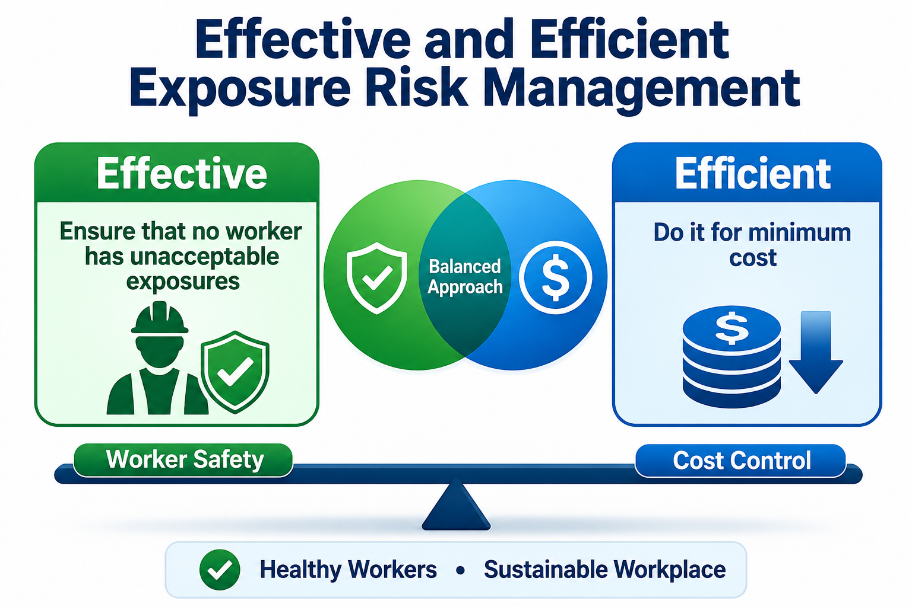{.lightbox width="50%"}

::: callout-important
**克服判斷偏誤與暴露變異性** - 勞工每天的暴露濃度具有高度的變異性。

在實務上，我們通常只能採樣到極少數的工作日（例如在每年 250 個工作天中僅採樣 5 天，只看見 2% 的真實暴露情況），這使得掌握整體**暴露實態**變得非常困難。研究顯示，如果僅**依賴直覺來解釋**這些少量的監測數據，專業人員的判斷往往是不準確的，且通常帶有**「低估風險」的偏誤**。然而，只要提供簡單的統計學訓練，就能大幅提升判斷的準確度並消除這些偏誤。
:::

## 1.2 決策統計量 (Decision Statistic)？

- ::: callout-note
  低估或高估暴露會怎樣？ Who should care?
  :::

- EA前先定義：**什麼樣的暴露情況是「可接受的」？** 這就是「決策統計量」。

- Q1：假設一位員工每年工作 100 天。如果你在這 100 天都進行個人暴露採樣，你認為在「不戴呼吸防護具」的情況下，**一年中有多少天暴露超過 OEL 是可以接受的？**

  - 選項：1) 0、 2) 1、 3) 5、 4) 10、 5) 25、 6) 50

  - **WHY？** 在統計學上，多數專業人員的共識是：**不超過 5 天（即 5%）** 超過 OEL。

    - 這對應的是 95th 百分位數 **（** $X_{95}$ **）**： **95% 的暴露值都低於 OEL**。

::: callout-caution
現實狀況：在多數工業衛生實務中，實際能採集的**樣本數通常遠少於 100 個 (Usual Number of Samples \<\< 100)**。這種小樣本的情況，會對我們估計整體暴露狀況（特別是估算第 95 百分位數時）帶來極大的**「不確定性 (Uncertainty)」**。
:::

## 1.2 決策統計量 (Decision Statistic) (續)

- 界定決策的信心水準

- Q：面對不確定性，你對自己的判斷有多大的把握（確定程度）？

  - 選項：1) 100% 確定、 2) 99%、 3) 95%、 4) 90%、 5) 70%、 6) 50%。
  - **WHY？** 實務上不可能 100% 確定，但專業共識是**追求 95% 的信心水準**。

#### 最終決策統計量：(判斷基準)

> **「至少有 95% 的信心，確信真正的暴露值** $X_{95}$ **\< OEL。」**

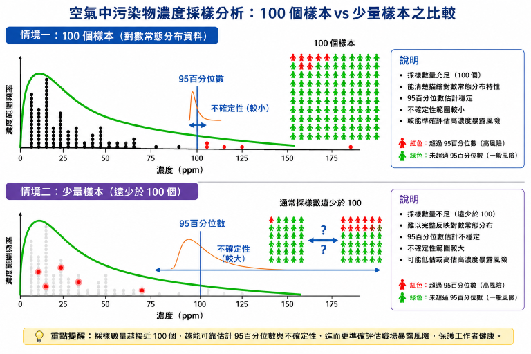{.lightbox width="50%"}

## 1.2 決策統計量 (Decision Statistic) (續)

##### **Q**：什麼是 $X_{95}$上限容忍極限 (UTL)？為何不用$X_{95}$直接與OEL比較即可？

> 因為「點估計」沒有考慮「抽樣誤差」，當樣本數很少時，點估計的信心很低，需要用 **UTL（上限）** 來「補償」不確定性。

::: callout-tip
- 如果 **UTL \< OEL**：有 **95% 信**心說真正的 95th 百分位數低於 OEL（✅ 可接受）

- 如果 **UTL \> OEL**，但 $X_{95}$ **點估計 \< OEL**：「可能過關，但信心不足」，屬於 **中或低度信心**，需要更多數據或暫時控管
:::

- $X_{95}$（點估計）→ 決定「最終評級」，判斷落在 Category 0\~4。
- $X_{95}$ UCL / UTL → 決定「確定性水準」(需要 UTL 來抓出「最壞情況的邊界」)
  - **High certainty**：若 UCL 落在同一類別內。Medium certainty：若 UCL 僅高出 1 個類別。**Low certainty**：若 UCL **高出 2 個（含）以上類別**。

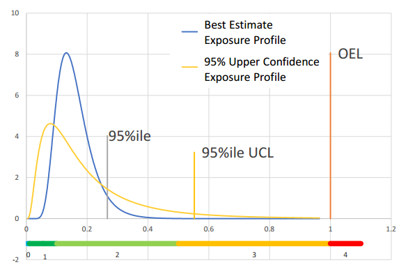{.lightbox fig-align="left" width="50%"}

## 1.3 AIHA 暴露類別

- AIHA 暴露控制類別 (Exposure Rating Categories)
  - **第 0 級**：\<1% OEL（無需行動，變更觀察）
  - **第 1 級**：\<10% OEL（程序與訓練、一般危害通識）
  - **第 2 級**：10-50% OEL（化學品特定危害通識、定期監測）
  - **第 3 級**：50-100% OEL（強制暴露監測、健康監測）
  - **第 4 級**：\>100% OEL（實施控制層級、呼吸防護具驗證）
- **台灣**
  - 危害性化學品評估及分級管理辦法 [第 10 條](https://laws.mol.gov.tw/flaw/FLAWDOC01.aspx?id=FL075605&flno=10)

## 1.4 暴露變異性 (Exposure Variability)

- 實務問題：暴露**高變異性** + 非常**少的樣本數**

  - **決策風險高**：用極少數的樣本去推估高度變異的母體，誤差風險極高。

- **暴露變異性**：員工每天的暴露量高度變動。如果一年工作 250 天，通常我們只能抽樣極少數的天數（例如 5 個樣本，僅能看見 2% 的暴露情況），這使得掌握**整體暴露實態**非常困難。

- 為解決只看到 2% 數據的困境，採用**推論統計學** (Inferential Statistics)。**但仍須留意**：[樣本代表性、測量數據品質、統計推論方法]{.underline}。

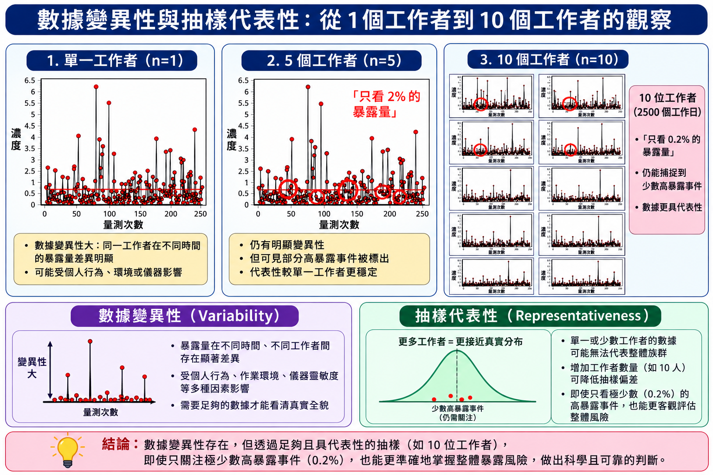{.lightbox width="50%"}

## 1.5 對數常態分布 (Lognormal Distribution)

- 統計學家 George E. P. Box ：「所有的模型都是錯的，但有些是有用的」。
- **推論統計學：**利用「已經看到」的極少量樣本，結合數據潛在分布形狀(假設數據符合對數常態分布)，推估整個 SEG 母體暴露實態。
- **對數常態分布**：過去數十年的研究顯示，職業暴露數據通常呈現「對數常態分布 」。主要參數：幾何平均數 (**GM**)和幾何標準差 (**GSD**)。
- **實務作法** ：有正式的統計檢定可用(檢定力低)，亦可用對數機率圖視覺檢查。
- **不符合怎麼辦？**：如果在分析前發現數據不符合對數常態分布，必須回頭檢視您的「相似暴露族群 (SEG)」設定是否合理，或數據有誤差等。

## 1.6 插曲：即時監測或直讀式儀器介入

- 問問AI如何？

::: callout-note
## Prompt

Q1：隨著科技進步，若使用直讀式儀器監測或即時偵測設備，且時間解析度可以到秒或分，紀錄便可完整呈現整天每天的暴露，這樣不是可以完整呈現變異性，且樣本數夠，這不就可以真實呈現人員或SEG的暴露實態？

Q2：如果把直讀式儀器測值的時間解析度，調整為8小TWA加權，或是15分鐘的STEL，這樣連續測定250天， 還有你上述說的自相關或是不符對數常態分布等等問題？
:::

#### [**AI say.....**](https://chat.deepseek.com/share/snmi06kfjl4ofrmky5)

#### 不再是「推論」，而是「普查 (Census)」，不需要算 UTL。

- 若要計算 STEL，應該取「**不重疊的 15 分鐘區間**」（例如 8:00\~8:15, 8:15\~8:30...），這樣每一筆 STEL 數據才會相互獨立。

### **你認為呢？**🤪

## 1.7 推論統計

- **點估計**：利用 GM 和 GSD 來計算出$X_{95}$的最佳估計值。
- **量化不確定性**：計算$X_{95}$的上限容忍極限 **(UTL95%,95%)**。
  - 如果UTL \< OEL，表示有超過 95% 的信心認定整體暴露情況未超標。
- 推論母體過程中的潛在誤差與挑戰
  - **採樣規劃不當**（未隨機、未涵蓋所有作業狀況）
  - **樣本數不足**（導致統計檢定力不足）
  - **數據處理不當**（如未正確處理未檢出值、異常值）
  - **統計方法錯誤**（如未檢驗數據是否符合對數常態分佈）
  - **SEG 分類錯誤**（將不同暴露特性的作業合併在一起）

## 1.8 關鍵參數 (**對數常態分布**)

- 幾何平均數 (Geometric Mean, GM)
- 幾何標準差 (Geometric Standard Deviation, GSD)
- 計算 GM 與 GSD？ (**建議用軟體**😇)

::: callout-important
## 提醒

進行統計分析前，**要先檢查暴露數據是否符合對數常態分佈**。
:::

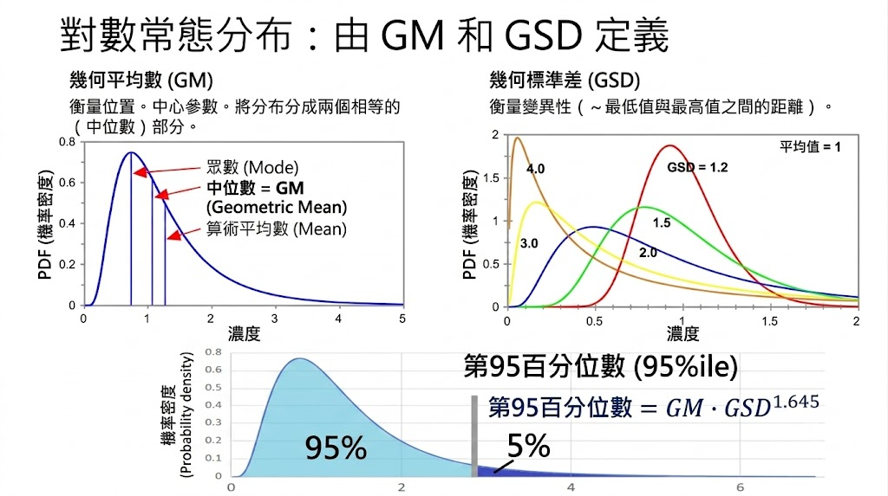{.lightbox width="50%"}

## 1.9 使用統計工具解釋資料

- 使用免費的傳統統計工具（如 AIHA 提供的 IHSTAT）

  ::: {}
  1.  **輸入資料**：輸入監測數據。
  2.  **評估適配度**：圖表檢查數據是否符合對數常態假設。
  3.  **檢視統計數據**：$X{95}$、$X{95}$ UCL 與 OEL 比較。
  4.  **評級與不確定性**：
      - **管理分級**：判斷 $X{95}$ 落在 AIHA 哪一個控制類別中。

      - **不確定性**：根據 $X{95}$ UCL 評估，如果 UCL 跨越超過 2 個類別，代表「低確定性」；跨越 1 個類別為「中確定性」；落在同一個類別內則為「高確定性」。
  5.  **記錄與建議**：記錄結果並建議相應的控制措施或後續採樣計畫。
  :::

|  |  |
|----|----|
| 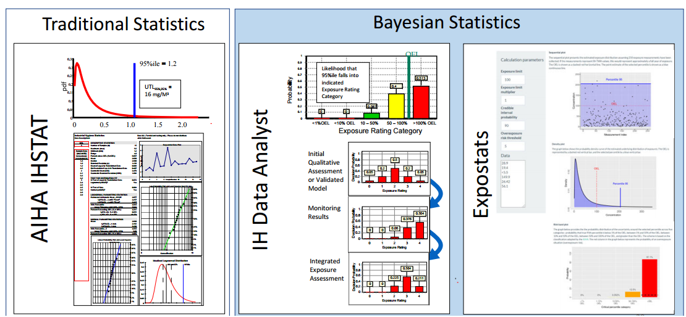{.lightbox} | 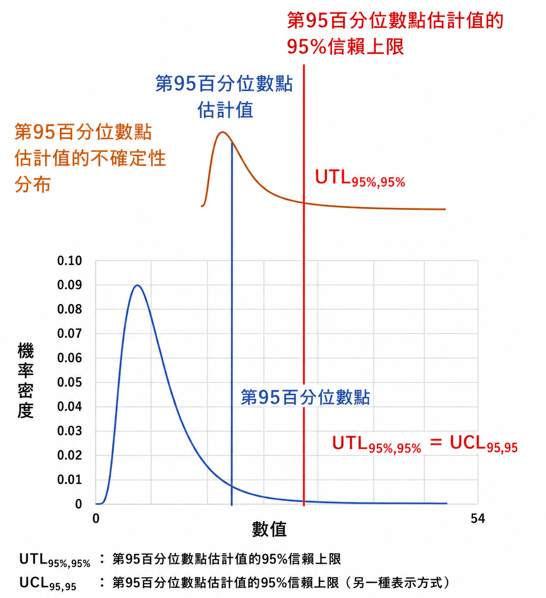{.lightbox width="50%"} |

## Case1.1 案例分析及演練

- 使用IHSTAT 或 IHDA_AIHA免費軟體
- **案例**：(感謝黃奕孝老師提供，報告10)
  - 有一家公司某一SEG有5個人，所用的化學品OEL是10，監測結果是 0.01、0.03、0.01、0.02、0.01、0.03、0.01、0.02、0.01、0.03、0.01、0.02， 如何進行推論統計陳現暴露實態?
  - 如果監測結果是0.1、0.3、0.1、0.2、0.1、9 ，結果？你的專業建議?
- **請進行暴露實態描述、管理分級(推論統計)與專業建議**

## 1.10 資料分析與解釋的步驟

1.  **先確實執行一個完善的監測計畫**，包含：已定義好決策統計值、明確的相似暴露族群 (SEG)、適當的 OEL、以及有效的採樣與分析方法等。
2.  **輸入數據 (**合適的統計工具，如 IHSTAT）
3.  **評估適配度 (**是否符合假設的統計模型，即對數常態分布）
4.  檢視統計數據
5.  指定最終管理分級與確定性水準
6.  記錄分析與建議

## 1.11 樣本數與統計不確定性

- **採集更多樣本是縮小信賴區間與容忍極限最有效的方法**。

|                                   |                                    |
|-----------------------------------|------------------------------------|
| 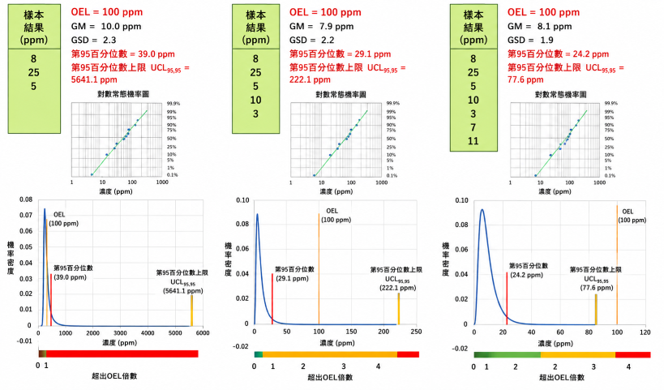{.lightbox} | 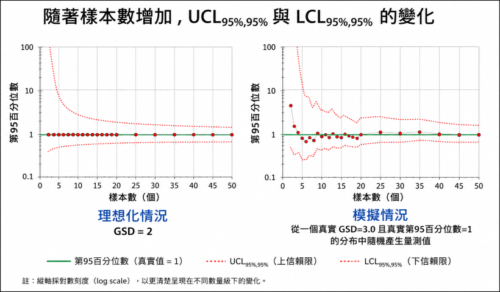{.lightbox} |

## 1.12 處理低於偵測極限的數據 (Censored Data)

- 當有採樣數據低於偵測極限 (Limit of Detection, LOD) 時，稱為「受限數據 (Censored Data)」

- **錯誤作法**：將未檢出數據直接從分析中刪除，或直接用偵測極限值來代替。(**絕對不要**)

- **正確作法**：在計畫階段應盡量確保 LOD 低於 OEL 的 10%。對於資料分析，若樣本數少且受限比例低，可使用簡單替代法（將 LOD 除以 2​，即 DL/1.414）來替代該數據。對於較複雜或受限比例高的數據，則建議使用最大概似估計法 (MLE) 或貝氏分析 (BDA) 等更進階的工具。

- 處理未檢出（受限）數據之方法與特性對照表

| 分析方法 | 簡稱 | 核心適用情境 | 特點 |
|----|----|----|----|
| **簡單替代法** | (DL/2 或 DL/2​) | \* 適用於**小樣本 (**n\<20**)** 且低到中等受限比例（\<25% 至 25%−50%）*的情況。* 估計第 95 百分位數時，以 **DL/**2​（即 LOD / 1.414）表現最合理。 | \* **非常容易**在一般的試算表（如 IHSTAT）中執行與實現。 |
| **最大概似估計法** | (MLE) | \* 適用於各種數據分布，被視為最接近「最佳通用方法」的統計手段。 | \* 統計效能與準確度極佳，但**計算公式非常複雜**。 |
| **Beta 替代法** | β-Sub. | \* 統計表現與最大概似估計法（MLE）非常類似。 | \* 公式直觀，**易於在 Excel 試算表中編寫程式**進行計算。 |
| **對數機率迴歸**(又稱順序統計量迴歸) | LPR或ROS | \* 適合用於**受限比例介於** 25% **至** 50%，且樣本數較大（n\>10 或 15）的數據集。 | \* **易於在試算表中編寫程式**進行計算。 在特定樣本數下是極佳的分析選擇。 |
| **貝氏決策分析** | BDA | \* 使用與 MLE 相同的數學方程，但**在描述與量化參數的不確定性上具有更優異的表現**。\*可輕鬆處理包含完全受限（完全未檢出）的數據集。 | \* **完全不需要數值替代**（不需將 \< 填補為特定數字）。 可**直接將原始含小於符號的數據**（如 **`<5`**）輸入 IHDA 或 Expostats 等分析工具中。 |

## 1.13 處理受限資料之原則

- **可做的事 (Do)：**
  1.  **做好採樣規劃**：在規劃階段就盡可能減少未檢出數據發生的可能性與其影響。
  2.  **確保足夠低的偵測極限**：致力於讓檢測方法的 LOD 低於職業暴露容許標準（OEL）的 **10%**。
  3.  **請實驗室提供 LOD**：分析時，要求偵測極限（LOD）數值， LOD 通常比定量極限（LOQ）低得多。
- **不做的事 (Don't)：**
  1.  **不要刪除數據**：會嚴重低估暴露風險。

  2.  **不要直接代入偵測極限值**：傳統統計直接用原始的 LOD 數值（例如將 **`<5`** 直接代入 **`5`**）來進行常態分布運算，這會扭曲估計結果。

## Case1.2 案例演練

##### 一組實際的受限數據範例（`8, 25, <5, 10, <3, 7, 11`），請使用工具進行暴露評估與建議。

## 1.14 回顧

### 資料分析與解釋五大步驟

1.  監測數據輸入至合適的統計分析工具
2.  評估適配度
3.  檢視敘述與推論統計數據
4.  指定管理分級與確定性水準
5.  記錄分析與建議

::: callout-important
若決策屬於「低確定性」（代表樣本數太少、誤差極大），即便評級落在安全的 Category 2，也應該適當提出追加採樣的行動建議，以收集更多數據來減少統計不確定性。
:::

## 1.14 監測計畫與EA

- 完成一個完善規劃的暴露監測計畫後，才能進行可信賴的暴露評估與風險管理。

## 1.15 解釋暴露監測數據的經驗法則

#### Rules of Thumb for 暴露資料

- 經驗法則能幫助OH在面對極少量監測數據時，不用依靠軟體，就能快速估算出管理分級。
- 經驗法則的數學原理 (對數常態分布)
  - $X_{95}=GM * GSD^{1.645}$
  - **GSD = 1.5（低變異）**：倍數為 **1.95**（約**2**）， **GSD = 2.0**：倍數為 **3.13**
  - **GSD = 2.5（中變異）**：倍數為 **4.51**（約**4**）， **GSD = 3.0（高變異）**：倍數為 **6.09**（約**6**倍）
- For Low n: If any measurement \> OEL then Category 4: 95%ile \> OEL

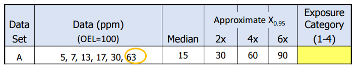{.lightbox width="50%"}

#### 還是**使用統計工具**，比較好又方便。

### **第 1 章結束**

# 2. 貝氏統計方法介紹及其優勢

## 2.1 暴露分布、點估計與不確定性分布

- 樣本數對「不確定性分布」的巨大影響

|  |  |
|----|----|
| 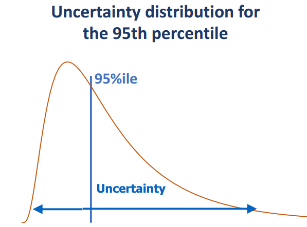{.lightbox width="189"} | 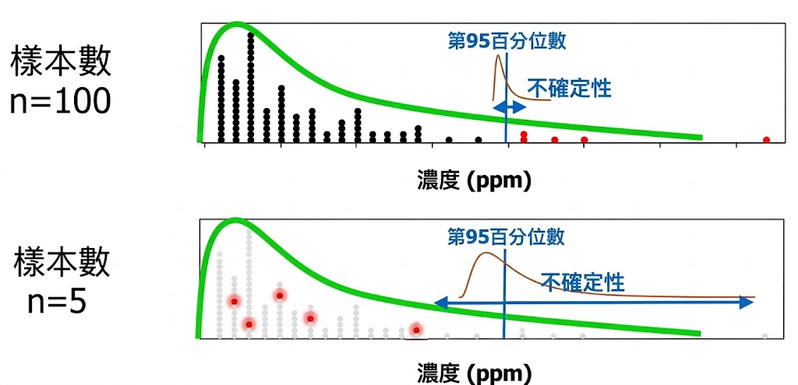{.lightbox} |

- **思考**：這95%ile跨越了哪些管理分級？而落在各個分級（如 Category 2、3 或 4）中的機率（Likelihood）各是多少？

## 2.1 暴露分布、點估計與不確定性分布 (續)

- 示範：**現場採樣數據**：`18, 15, 5, 8, 12` ppm（樣本數 n=5）
  - GM = 10.5 ppm， GSD = 1.67，**95%ile** = 24.5，**UCL** = 91.6
  - SEG 暴露分布、95%ile點估計與分布(不確定性) 之管理分級？

|  |  |
|----|----|
| 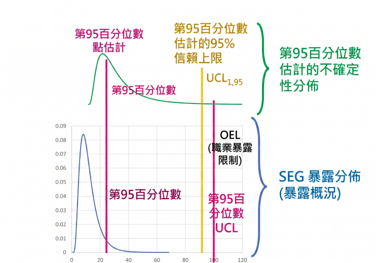{.lightbox width="237"} | 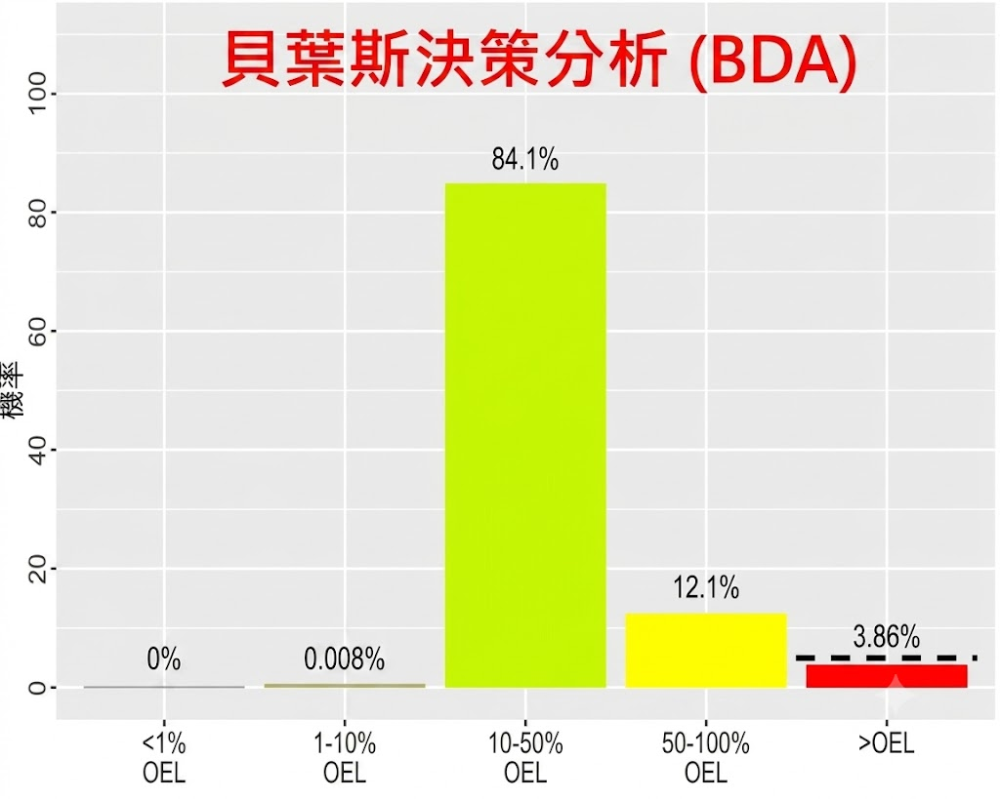{.lightbox width="209"} |

- 將「不確定性」轉為控管理分級的機率，是**BDA**的核心概念。

## 2.2 貝氏決策分析 (BDA)？

- 示範：乙醇（Ethanol，OEL = 1000 ppm）的SEG 監測。**現場採樣數據 (**n=5**)**：**`215, 52, 395, 700, 75`** ppm。
  - GM = 188 ppm，GSD = 3，95%ile = **1140** ，UTL95%,95% = **18,700** 。
- BDA**直接計算出95%ile落在各個管理分級的機率 (Likelihood)。**

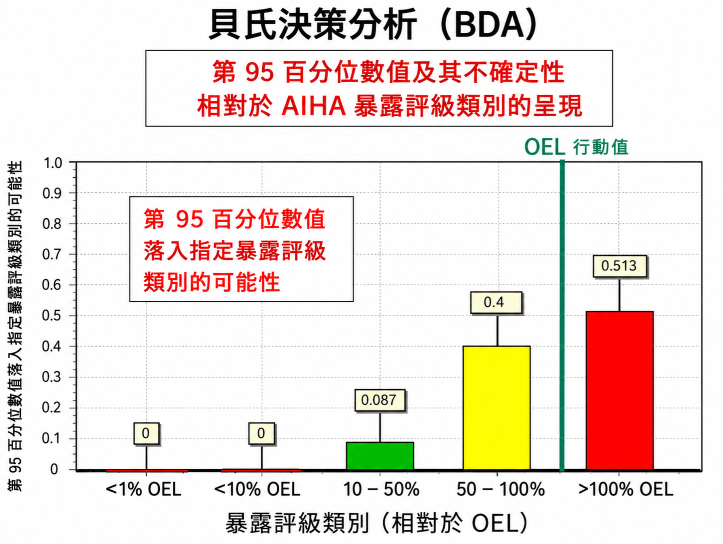{.lightbox width="326"}

## 2.2 貝氏決策分析 (BDA)？(續)

- BDA 是計算與解釋傳統統計數據的**輔助（或替代）方法**。
  - 用來量化與描述第 95 %ile及其不確定性(管理分級機率)。
  - 呈現小樣本不確定性，易理解，易溝通。

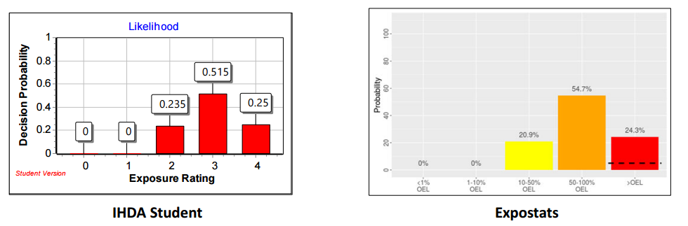{.lightbox}

## 2.2 貝氏決策分析 (BDA)？(續)

- 暴露分布 = BDA ？

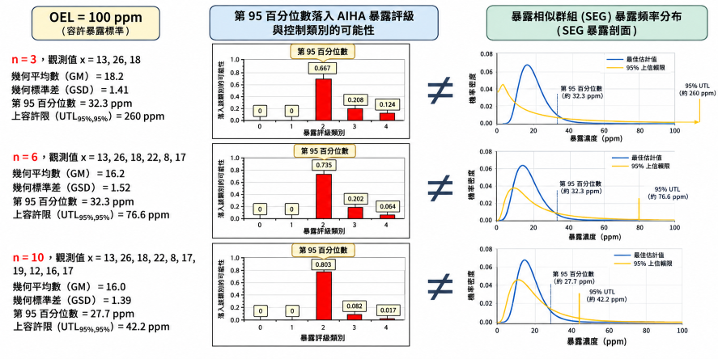{.lightbox width="435"}

## 2.3 BDA概念(General Approach)

- 第一步：**「定義可能對數常態暴露輪廓的宇宙 (Universe)」**
  - 不直接從樣本去算，而是先**定義出一個由無數種可能符合對數常態分布之暴露輪廓所組成的Universe**。
    - 參數的組合 (each GM, GSD -\> one 95%ile)。
    - 真實的現場暴露是屬於這無數條曲線中的一條。
- **步驟二** ：拿實際採集到的監測數據，去計算數據來自於該宇宙中每一個暴露輪廓的**概似值(Likelihood)**。
  - 已經觀察到一組數據，某個模型參數能夠解釋這批數據的程度。(已知結果，反推原因)

    - **概似函數**：把不同的參數帶入計算，看每個參數對現有數據對應的可能性。

    <!-- -->

    - **最大概似估计 (MLE)**：尋找能讓概似值達到最高點的那個參數，這被視為對真實暴露情況的最佳猜測。(不一定唯一，也不一定存在) ([解釋1？](https://rgib37190.github.io/%E9%82%84%E6%98%AF%E6%90%9E%E4%B8%8D%E6%87%82%E4%BC%BC%E7%84%B6likelihood%E5%97%8E%E7%9C%8B%E7%9C%8B%E9%80%99%E7%AF%87%E7%9A%84%E4%BD%A0%E5%B0%B1%E6%87%82%E4%BA%86/) [解釋2](https://medium.com/qiubingcheng/%E6%9C%80%E5%A4%A7%E6%A6%82%E4%BC%BC%E4%BC%B0%E8%A8%88-maximum-likelihood-estimation-mle-78a281d5f1d))
- **步驟三**：將這些概似值加總與標準化，得出落在各個 AIHA 暴露控制類別的決策機率。

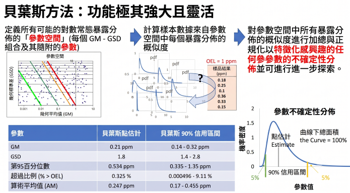{.lightbox width="388"}

## 2.3 BDA概念(續)

- 利用先驗知識（Prior Knowledge）調整與加權參數空間universe(GM-GSD 組合)。

  - 根據暴露情境已知的先驗知識，或各暴露輪廓發生的相對合理性(如定性模型、歷史數據、專家主觀判定、或推估模式)，來對這個參數空間進行調整與加權。
    - 不只能評估第 95 %ile，同時精確描述如GM、GSD、算術平均數 (AM) 或超標比例 (Exceedance Fraction) 等多種關鍵暴露指標的不確定性分布。

|                                    |                                    |
|------------------------------------|------------------------------------|
| {.lightbox} | 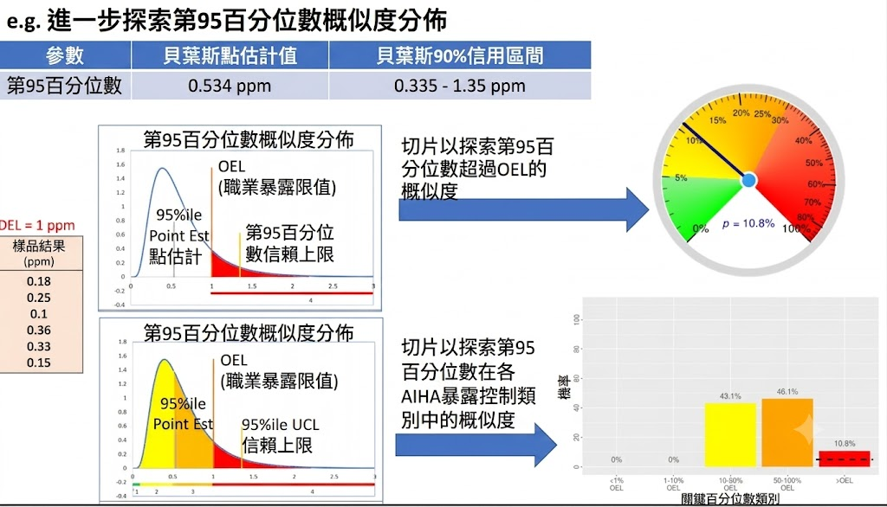{.lightbox} |

## 2.4 參數空間 (略)

## 2.5 判讀BDA圖表

- 確認「最有可能」的類別
- 確認「超標風險」是否符合控制標準
  - 95%ile落在 Category 4 的機率是否小於 5%
    - **\< 5%**：**可接受 (Acceptable)**。有高度信心確信暴露在安全範圍內。
    - **5% \~ 30%**：**可容忍 (Tolerable)**。**該 SEG 必須有定期執行的暴露監測計畫**，隨時掌握暴露波動。
    - **\> 30%)**：**有問題**。代表超標風險過高，SEG 須有後續監測計畫。

## Case2.1 案例演練

- 樣本監測值 (ppm)：13，26，18， OEL = 100 ppm
- 請進行EA及BDA管理分級，並提出專業建議

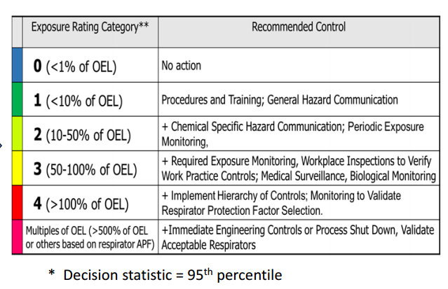{.lightbox width="348"}

## Case2.2 案例演練

- 樣本監測值 (ppm)：13，26，18，32，18，13

- 樣本監測值 (ppm)：55，33，45，66，20

- 噪音監測(Dose (80, 5))：55.9，30.8，67.8，85.9，41.8，34.4

## Case2.3 案例演練

#### RPE選擇？

- 將輸入工具中的 OEL 替換為「APF (指定防護係數) × OEL」
  - Category 4：戴上PRE後，勞工暴露量仍APF的機率(likelihood。
- 個案：OEL=1 ppm，採樣值 0.99, 0.50, 2.0 ppm。
- 請針對以下條件，**評估呼吸防護是否足夠？**
  - 選用 APF = 10。
  - 選用 APF = 50。

------------------------------------------------------------------------

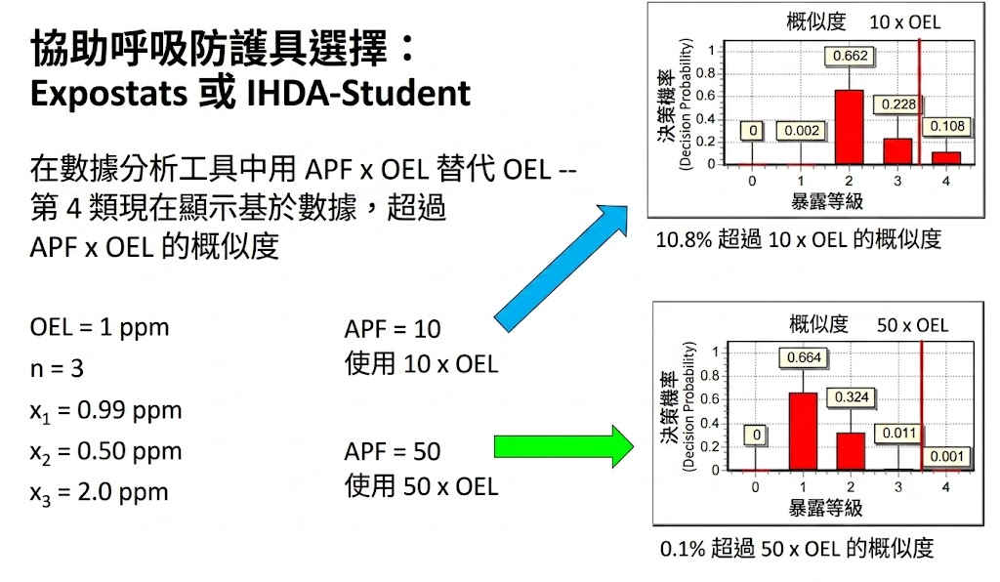{.lightbox width="317"}

## 2.6 先驗機率(略)

- 定性(專業主觀判斷)或定量(數學模型推估、監測)
- 無資訊（Non-informative）先驗 vs. 資訊性(Informative)先驗
  - 除非有一個『經過驗證（validated）』的暴露評估模型，否則應優先使用無資訊先驗（flat prior）。

## 2.7 BDA 處理受限資料 (Censored Data)(略)

## 2.8 小結

#### 貝氏統計優勢

1.  更直覺的暴露與不確定性描繪
2.  易進行溝通
3.  **極佳的小樣本評估能力（包括** n=1**）**
4.  **高效處理受限（未檢出）數據**

### 第2章結束

# 3.貝氏統計工具1

## Free Bayesian Statistical Tools

##### Ref: Free Bayesian Statistical Tools, Paul Hewett PhD CIH FIOH, Exposure Assessment Solutions, Inc.

- 3.1 [IHDA Student Edition](https://www.aiha.org/public-resources/healthierworkplaces/workplace-hazards/apps-and-tools-resource-center/aiha-risk-assessment-tools/ihda-aiha)
- 3.2 Expostats
- 3.3 IHSTAT_Bayes™

## 3.1 IHDA 軟體介紹

### 3.1.1 資料分析與解釋

#### 步驟

+------------------------------+------------------------------------------------+
|                              |                                                |
+==============================+================================================+
| 1.  收集或提取數據           | 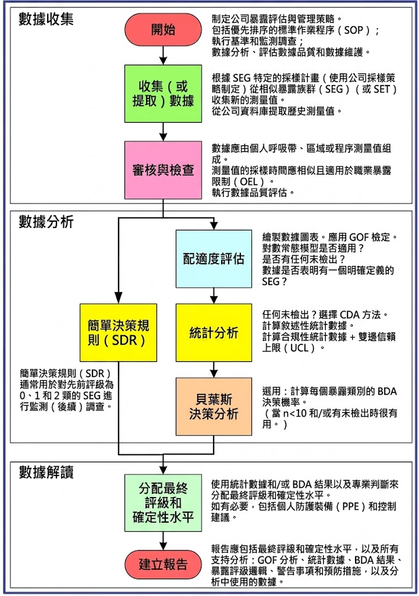{.lightbox width="196"} |
| 2.  輸入程式與執行           |                                                |
| 3.  評估適配度               |                                                |
| 4.  評估敘述與合規統計量     |                                                |
| 5.  評估貝氏決策分析圖       |                                                |
| 6.  指定管理分級與確定性水準 |                                                |
| 7.  記錄分析與建議           |                                                |
+------------------------------+------------------------------------------------+

## Case 3.1 案例演練

#### 使用IHDA工具，進行EA、管理分級與建議

- **non-informative prior**
  1.  OEL=0.2 mg/m3 ，n = 4， x = {0.015, 0.008, 0.006, 0.016}
  2.  OEL=1 ppm， n = 1， x = 0.05 ppm
- **informative prior**
  1.  OEL=1 ppm， n = 3， x = {0.25, 0.50, 1.00}
  2.  data as above, what RPE is suitable (APF)?

## Case 3.2 案例演練

#### Q：數據顯示與判讀？

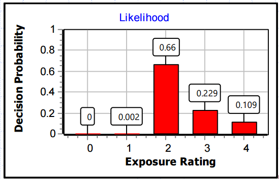{.lightbox width="343"}

- 根據此概似機率決策圖(Likelihood decision chart), 以下哪個陳述是對的？
  - [ ] 66% 的暴露值介於OEL的10% \~50%？
  - [ ] 有66% 機率，暴露值的95%ile介於OEL的10% \~50%？
- 此SEG 判定為 Category 2（有 66% 的最高機率落在此區間），等於做出了「暴露安全、無須立即停工改善」的結論。 然而，仍需注意做出**錯誤決策的機率** (誤判為安全而卻超標風險)**是多少**？

## Case 3.3 案例演練

##### 該相信軟體的基本設置？(當GSD大時)

- OEL = 1 ug/m3, X={0.25, 0.03, 0.02, 1.1, 0.14, 0.01 }
- 請做BDA與專業建議

## 3.1.2 小結

- **別單一依賴 BDA，將其與現有的其他統計工具搭配使用**。

- 在進行EA時，應同步驗證：

  1.  **適配度與檢定**：驗證對數常態分布的假設，避免模型失真。

  2.  **敘述統計量**。

  3.  **合規統計**：95%ile與不確定性上限 (UCL)。

- **得出結果後，自問(確保決策的科學性與合理性)：**

  - **Q1：**「BDA 圖是否合理解釋數據？」

  - **Q2：**「哪一種解釋最可能是正確的？是 **BDA 或現有的數據分析工具**（傳統統計）？」

### 第3章第1節結束

## 3.2 Expostats 介紹

ref: Jérôme Lavoué, Lawrence Joseph, Peter Knott, Hugh Davies, France Labrèche, Frédéric Clerc, Gautier Mater, Tracy Kirkham, Expostats: A Bayesian Toolkit to Aid the Interpretation of Occupational Exposure Measurements, Annals of Work Exposures and Health, Volume 63, Issue 3, April 2019, Pages 267–279, <https://doi.org/10.1093/annweh/wxy100>

- **Tool 1：SEG 是否符合 OEL？**

- **Tool 2：SEG 中不同勞工之間的暴露變異度有多大？**

- **Tool 3：干預措施是否有效？SEGs間是否有顯著差異？**

## **3.2.1 Tool 1：SEG 是否符合 OEL？**

- 貝氏統計價值：即使不在現場，也能根據有限的樣本，推估並描述**真實暴露輪廓的實況與不確定性**。

  - 母體參數：GM 與 GSD 貝氏點估計值，以及可信區間 (Credible Intervals)。
  - 三種關鍵決策統計量 (Decision Statistics) 含CI：95%ile、超標比例 (Exceedance fraction)、算術平均值
  - 貝氏決策分析圖 (BDA chart)、風險溝通資訊圖表 (Infographics)

## 3.2.1 貝氏統計運作

- **先驗知識（Prior）+ 實測觀測數據（Observations）+ 後驗知識（Posterior）**。
  1.  先驗分布 — 既有認知
      - **GM**：預設Non-informative - 預期所有 ln(GM) 值的出現機率皆相同（均勻分布）。
      - **GSD**：微資訊先驗Slightly Informative Prior (Rappaport 等學者 GSD 歷史數據庫)。
  2.  實測數據 — 新資訊引入
      - 例如，Styrene（苯乙烯）：**`190, 47, 181, 89.5, 391, 82.7`** mg/m³。
      - 這些觀測值與對數常態統計模型結合，計算出該組數據在不同 GM 與 GSD 組合下出現的「概似值（Likelihood）」。
  3.  後驗分布 — 更新後的資訊 - 貝氏運算引擎（JAGS 吉布斯採樣器） - 將**先驗知識**與**觀測數據的概似值**進行乘積與標準化計算。 - 輸出更新後的 **GM** 與 **GSD** 後驗分布。
      - 此時的 GM 與 GSD 已不再是寬廣無邊的假設，而是被這 6 個實測數據緊密收斂、能切實反映該苯乙烯 SEG 暴露特徵的機率分布。

|                                    |                                    |
|------------------------------------|------------------------------------|
| 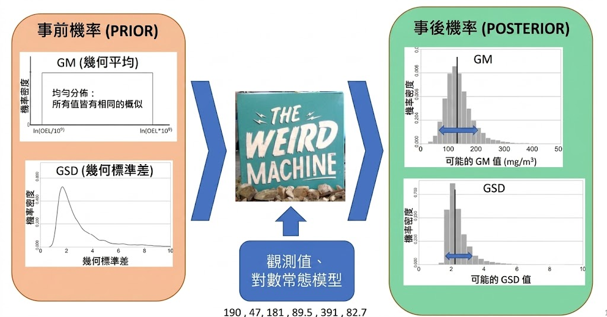{.lightbox} | 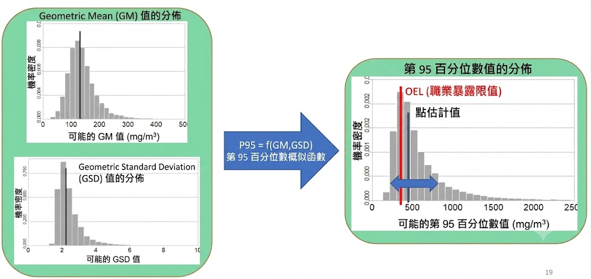{.lightbox} |

## Case 3.4 案例演練

- Styrene（苯乙烯）：**`190, 47, 181, 89.5, 391, 82.7`** mg/m³。OEL=350

- **請進行EA、管理分級與專業建議 (依據產出圖表進行說明)**

## **3.2.2 Tool 2：SEG 中不同勞工之間的暴露變異度有多大？**

#### (略，如果有時間)

## **3.2.3 Tool 3：干預措施是否有效？SEGs間是否有顯著差異？**

#### (略，如果有時間)

## 3.3 IHSTAT_Bayes 介紹

#### (略)

## 4. 利用統計工具執行 AIHA 策略
