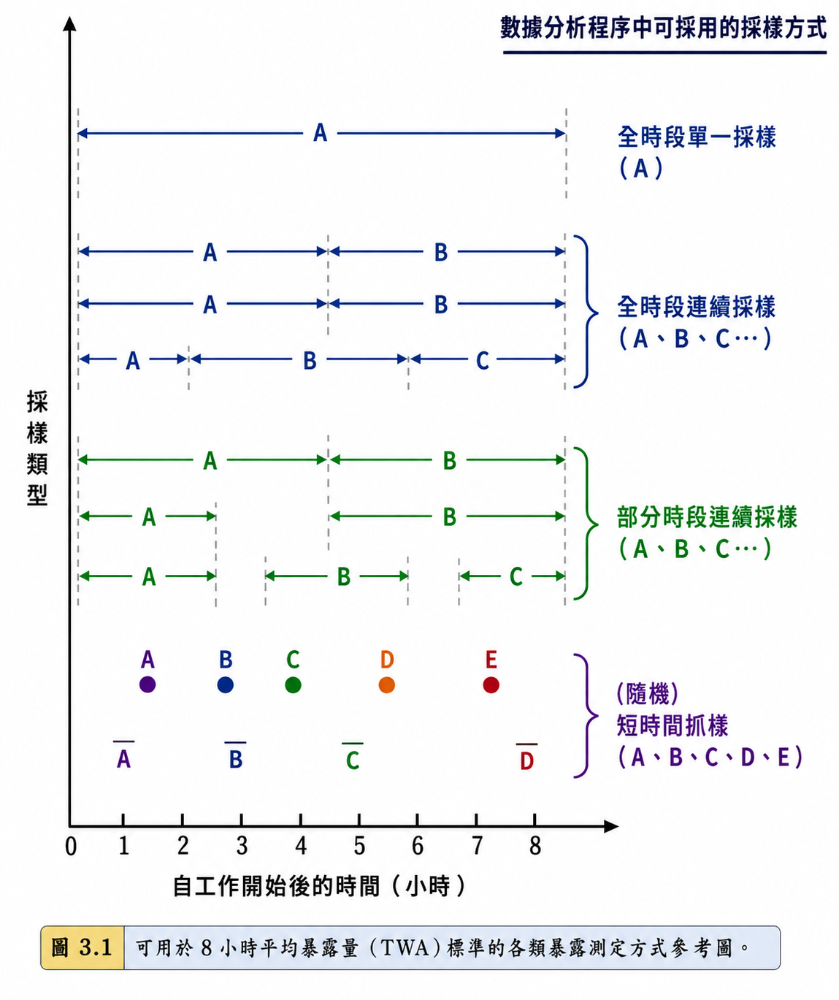
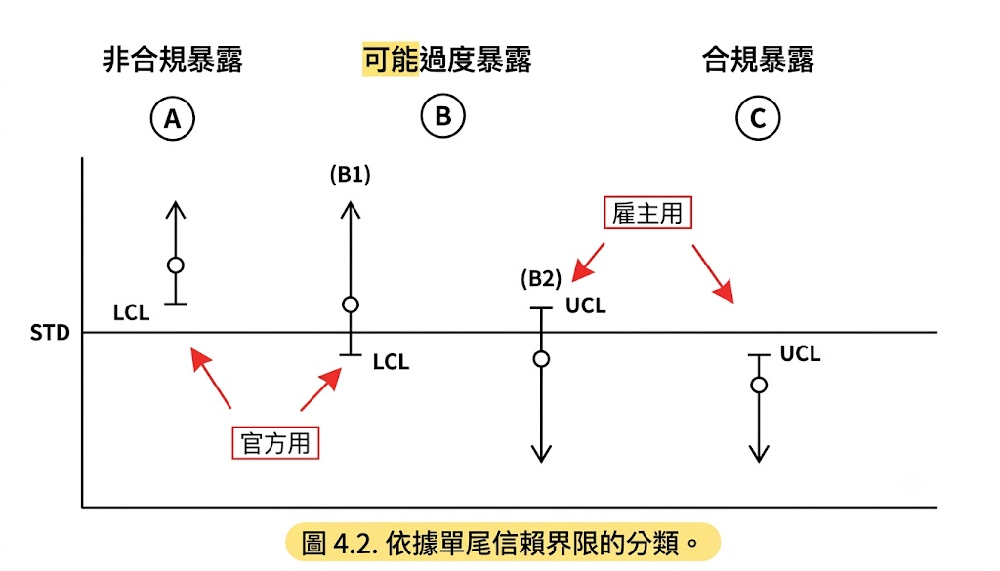
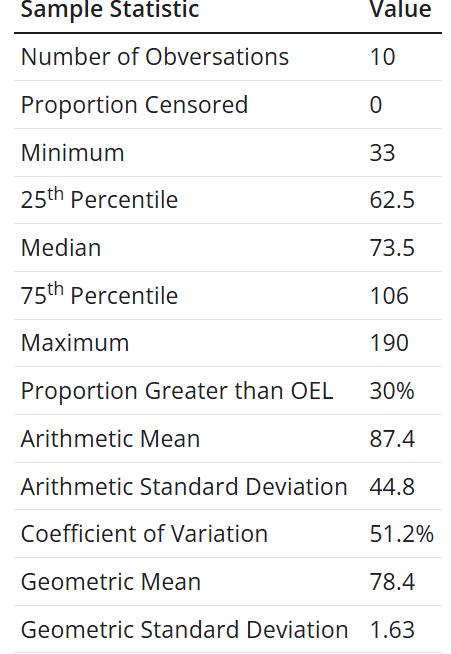
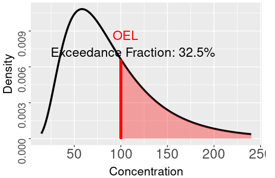
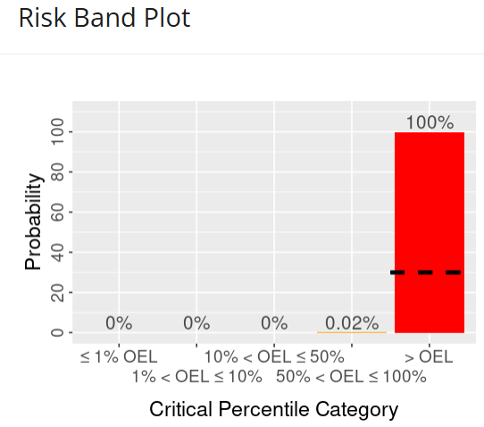
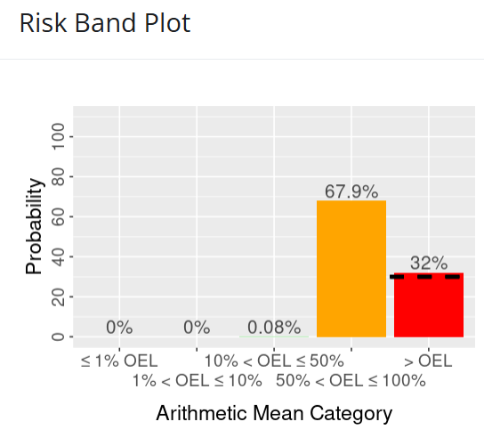

## 講師簡介 {.custom}

- 姓名：何明信
- 學歷：成大環醫所 、職安衛技師
- 經歷：檢查員30年 (製造、危機設、營造、化工**職衛科**、專委)
- 現職：114年退休
- E-mail：msho7336959\@gmail.com

# NIOSH職業暴露採樣策略手冊

## NIOSH(1977)

- 特色

  - **取樣策略**：具代表性且有效的取樣。(捕捉暴露變異)
  - **合規性**：結果符合職業安全與衛生標準？(EA)

## 1. 取樣策略

- MEG / SEG (**隨機**)
- 取樣數量與信心水準 (Table 3.1)
- 考慮**統計分布模型**(常態或對數常態），以利科學分析。

| **標準類型** | **定義**                                | **應用場景**         |
|--------------|-----------------------------------------|----------------------|
| **TWA**      | 平均暴露濃度，通常以 8 小時工作日為基準 | 長期慢性暴露風險     |
| **STEL**     | 15 分鐘平均暴露限值                     | 短時間高暴露但非瞬時 |
| **Ceiling**  | 任意時間點不得超過的最高濃度            | 急性效應防護         |

## 2. EA

- 透過系統化的辨識、測量與統計分析
  - 判斷員工是否可能超過OEL，並據此採取管理控制措施。
  - 結合了科學數據與專業判斷，避免急性或慢性健康危害。
- EA 步驟：**危害辨識、暴露特徵化、暴露測量、統計分析**
- 統計決策：95% 信心水準下，合規、可能過度暴露、不合規。

## 3. 暴露監測計畫

- 為確保工作場所安全與合規，系統化規劃、執行與評估取樣，以便提供可靠的數據支持暴露風險管理。

- 流程

  1.  需求分析
      - 監測目的：合規、研究、或健康保護。
      - 監測群體：高風險員工、代表性群體或全體。
  2.  取樣策略
      - 選擇代表性取樣方法（隨機、最大風險員工、週期性）。
      - 決定取樣數量與信心水準。
  3.  數據分析
      - 使用統計模型。

      - 判斷合規、可能過度暴露或不合規。

## Case1 案例演練

#### 簡答題

1.  請說明 **隨機取樣** 與 **最大風險員工取樣** 的差異。
2.  為何在暴露評估中需要使用 **對數常態分布模型**？

## Case2 案例演練

- **情境**：某化工廠有 40 名員工，主要作業為使用揮發性有機化合物 (VOC) 進行清洗與溶劑操作。近期有員工反映眼睛刺激與呼吸不適，管理層決定啟動暴露監測計畫。

- 請依據你的專業，規劃採樣策略 (樣本具代表性、取樣推論具90%信心水準以上)

#### 提示

1.  需求分析 (目的+MEG / SEG)
2.  採樣設計 (人數、方法)
3.  數據分析 (工具、決策標準OEL-TWA / STEL / Celling)
4.  管理分級與建議

## 3.1 採樣方式規劃

- 不同取樣方式**會影響**數據的代表性與統計分析方法。

- 實務

  - **合規檢查**：檢查員檢查時，最好是全期或全期連續樣本。

  <!-- -->

  - **研究或初步調查**：隨機抓樣能快速提供分布概況。

  - **資源有限時**：分期連續樣本可作為替代，但需謹慎解讀。

{.lightbox width="391"}

## 4. 統計分析概念

#### **4.1 信賴區間** (4.1 Confidence Interval Limits)

- 表示數據**不確定性**範圍，常見設定為 95% 信心水準。

- 實務

  - 單一測量值不足以判定合規，需要透過**信賴區間**來確保判斷的科學性。

  <!-- -->

  - **樣本數越多**，信賴區間越窄，判定越精確。

  - 當信賴區間涵蓋OEL時，必須進行**補充取樣或加強監測**。

- 判定流程

  1.  收集數據 + 計算平均值及標準差
  2.  **建立信賴區間**
      - 統計計算 95% 信賴區間的上下限 (LCL/UCL)。
  3.  與標準比較 (TWA、STEL、Celling)
  4.  **判定** (合規、可能過度暴露、不合規)
  5.  **後續措施**

{.lightbox width="370"}

## 4. 統計分析概念 (續)

- 誤差：隨機採樣誤差+化學分析誤差 = **CV~T~** ~(見附件D)~
- **測值 X 僅是真實暴露濃度** μ **的一個「點估計值」。**
- 為兼顧合規與保護勞工，引入**單邊 95% 信賴區間的**假說檢定。

## 4.2 EA of TWA_8hr

#### 4.2.1 全時段單一樣本（Full Period Single Sample Measurement）

- 計算參數與步驟
  1.  ​數據標準化 (使OEL=1) $x= X / OEL$
  2.  計算信賴上限（​UCL95%）
      - **檢查員：「違規檢定」**（H~0~: μ≤OEL）： LCL95%​=x−1.645×CV~T~​
        - *若* $x$ *≤1.0，檢查員無須計算 LCL，直接判定無法證明違規。*
      - **雇主的：「合規檢定」**（H~0~: μ\>OEL）： UCL95%​=x+1.645×CV~T~​
        - *若* $x$\>1.0*，雇主無須計算 UCL，判定可能超標或不合規。*
  3.  暴露風險分類
      - A區：LCL95%​ \> 1.0
        - 指排除測量隨機誤差後，仍有 **95% 以上的統計信心**確信勞工真實暴露平均值已超越標準。必須控制並重新採樣。
      - B區：LCL95%​ ≤ 1.0 ≤ UCL95%​。
        - 重新採樣，提高監測頻率以降低不確定性。
      - C區：UCL95% ​\< 1.0。
        - 有 **95% 以上的統計信心**確認真實暴露低於OEL，維持定期評估。

## Case3 案例演練

- 已知現場監測數據：
  - 被測化學因子：**苯氯乙酮（alpha-chloroacetophenone）**
  - 量測儀器：活性碳管與個人採樣泵，流率 100 cc/min，連續採樣 8 小時（全時段）。
  - 實驗室分析報告濃度 X：0.04 ppm
  - 該採樣分析方法之總變異係數 (CV~T~​)：0.09
  - 法定 8 小時 TWA 容許濃度 (OEL)：0.05 ppm
- 請進行暴露管理分級(含計算)與建議
  - 提示：UCL95%​=0.95
- 若使用軟體工具，怎麼處理？

## 4.2 EA of TWA_8hr (續)

#### 4.2.2.1 全時段連續樣品量測（Full Period Consecutive Samples）

- 黃金標準，相較於單一 8 小時的樣品，連續收集數個短時間樣品（例如 2 個 4 小時樣品）能提供EA優勢：

  1.  **縮小信賴區間**：因為增加樣本數（n）。

  2.  **考慮日間變異**：掌握暴露實態。

- 假設：在各時段內，為均勻暴露（Uniform Exposure）？

## Case4 案例演練

- 已知現場監測數據：
  - 被測物：異戊醇 **isoamyl alcohol**
  - 8 小時 TWA 標準（OEL）：100 ppm
  - 方法之總變異係數（CV~T~​）：0.08
  - 連續個人採樣數據：
    - X1 = 90 ppm，T1 = 150 min

    - X2 = 140 ppm，T2 = 100 min

    - X3 = 110 ppm，T3 = 230 min
- 請進行暴露管理分級與建議
  - 提示：UCL95%​=1.02

## 4.2 EA of TWA_8hr (續)

#### 4.2.2.2 部分時段連續樣品量測（Partial Period Measurement）

(略) 沒研究，有興趣請自習

## 4.2 EA of TWA_8hr (續)

#### 4.2.3 瞬時採樣策略（Grab Samples Measurement）

- 儀器：使用直讀式氣體偵測器、檢知管等時
- 當小樣本(n\<30)時，用對數常態模型
- 計算參數與步驟
  1.  ​數據標準化 $x= X / OEL$
  2.  對數轉換 $y_i =log_{10}(x_i)$
  3.  計算算術平均值與樣本標準差，查圖( Figure 4.3)判定

## Case5 案例演練

- 已知現場監測數據：
  - 被測化學因子：**乙醇（Ethyl Alcohol）**

  - 量測方法：個人採樣泵（流率 25 cc/min），共採集 **8 個活性碳管抓樣**，每管暴露 20 分鐘

  - 法定 8 小時 TWA 標準（OEL）：1000 ppm

  - 該方法的總變異係數（CV~T~​）：0.06

  - 實驗室報告的 8 筆原始測定濃度（X~i~​）： 1225, 800, 1120, 1460, 975, 980, 525, 1290 ppm

<!-- -->

- 請進行暴露管理分級與建議 (使用AIHA方法)
  - 提示： $X_{95}=GM⋅GSD^{1.645}=1.71$

## 4.2 EA of TWA_8hr (續)

#### 4.2.4 瞬時採樣策略（Grab Samples Measurement）

- 儀器：使用直讀式氣體偵測器、檢知管等時
- 當大樣本(n\>30)時，用常態模型(中央極限定理)
- 計算式： $UCL_{95\%} =\overline{x} +1.645⋅\frac{s}{\sqrt{n}}​​$

## Case6 案例演練

- 已知現場監測數據：
  - **量測對象**：用直讀式臭氧分析儀與紀錄器，監測一名固定站點勞工的暴露。
  - **法定 8 小時 TWA 標準（OEL）**：0.1 ppm。
  - **樣本數** n：於 8 小時班次內隨機選取 **35 個時間點**讀取濃度值（大樣本 n\>30）。
  - **35 筆原始測定濃度** X~i~​**（ppm）**： **`0.077, 0.043, 0.061, 0.070, 0.107, 0.084, 0.062, 0.127, 0.057, 0.101, 0.072, 0.145, 0.084, 0.101, 0.105, 0.125, 0.076, 0.079, 0.078, 0.067, 0.073, 0.069, 0.084, 0.066, 0.085, 0.080, 0.071, 0.103, 0.075, 0.048, 0.092, 0.066, 0.109, 0.110, 0.057`**
- 請進行暴露管理分級與建議
  - 提示： $UCL_{95\%} =\overline{x} +1.645⋅\frac{s}{\sqrt{n}}​$

## 4.2 EA of 最高容許濃度（Ceiling)

- 防止急性毒性、嚴重刺激或麻醉效應
- 在預期高濃度時段採集的短期樣本，通過統計學假設檢定，評估勞工暴露風險。
- 計算參數與步驟
  1.  篩選最大值並標準化
  2.  計算 $UCL_{95\%} =max{(x)} +1.645⋅CV_T​$
  3.  暴露風險判定

## Case7 案例演練

- 已知現場監測數據：(**硫化氫（Hydrogen Sulfide,** H2​S**）**。
  - **方法**：檢知管，CV~T~：0.14，**Celling**：20 ppm (OSHA)
  - 暴露量測：該勞工在班次內約有 16 個短暫暴露時段，評估者隨機抽選其中 5 個時段進行量測（n=5），獲得以下 5 筆原始測定濃度： 12, 14, 13, 16, 15 ppm
- 請進行暴露管理分級與建議
  - 提示：$UCL_{95\%} =max{(x)} +1.645⋅CV_T​$
- 如果使用MSA ALTAIR 5X (內建幫浦) 來量測，結果是？
  - 直讀式偵測器經氣體校正後，CV~T~=0.05

## 小結

- **監測**的目的在於科學化評估勞工的長期暴露實態
- **EA 專業**：利用有限天數監測數據（日與日間變異），科學推論勞工在未監測工作日中的超標風險，進而理性決定是否投入裝設工程控制設施。
- 勞工在日間（Day-to-day）的 8 小時 TWA 暴露並非恆定不變，而是受製程產量、氣流、原料及人員操作習慣等動態波動。科學實證，長期日間 8 小時 TWA 暴露呈現**對數常態分佈，**該分佈由兩個參數決定：**GM，GSD**。
- 隨機採樣與化學分析誤差（通常 CVT​≤0.10） 相較於日間環境變異度 (GSD 介於 1.5 至 2.5 之間），對長期平均值估算的不確定性影響微乎其微。
- **暴露控制決策目標（5% ）**： 安全衛生的自主管理目標，是將勞工日暴露 TWA 超越法定容許標準（STD/PEL）的機率，限制在 5% 以下。(不合規率必須小於或等於 0.05)

## Case8 案例演練

- 已知監測數據與參數：(ref: P65 section 4.4)

  - **二氧雜環己烷（Dioxane）**，8 小時 TWA 法定容許標準100 ppm。
  - 6 個月內隨機挑選 10 天實施 8 小時個人 TWA 採樣（n=10）： {67, 51, 33, 72, 122, 75, 110, 93, 61, 190}

- 請進行暴露管理分級與建議

  - 請用[Expostats](https://expostats.ca/site/en/) tool1 進行暴露評估與建議
  - 建議閱讀文獻
    - Jérôme Lavoué, Lawrence Joseph, Peter Knott, Hugh Davies, France Labrèche, Frédéric Clerc, Gautier Mater, Tracy Kirkham, Expostats: A Bayesian Toolkit to Aid the Interpretation of Occupational Exposure Measurements, *Annals of Work Exposures and Health*, Volume 63, Issue 3, April 2019, Pages 267–279, <https://doi.org/10.1093/annweh/wxy100>

|  |  |
|----|----|
| {.lightbox width="157"} | {.lightbox width="236"} |
| {.lightbox width="224"} | {.lightbox width="230"} |

## 持續更新中\~\~\~
