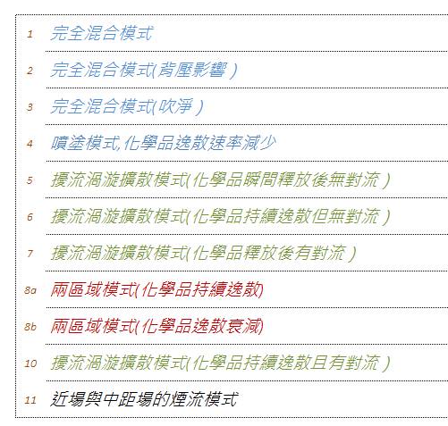

## 講師簡介

- 姓名：何明信

- 學歷：成大環醫所 、職安衛技師

- 經歷：檢查員30年 (製造、危機設、營造、化工職衛科、專委)

- 現職：114年退休

- E-mail：msho7336959\@gmail.com

## **IH Mod 2.0: Freeware Models with Monte Carlo Simulation 介紹**

- IH Mod 2.0 這款工具，它是由**美國工業衛生協會（AIHA）**「暴露評估策略委員會」免費提供的一套數學模型套裝軟體，專門用於使用數學模式推估工作場所的空氣中化學物質濃度。
- 特點：
  - 核心功能：蒙地卡羅模擬
  - **機率性方法**：輸入參數（如房間通風率Q、化學品釋放率G等）可定義可能的分布範圍，例如常態分佈、對數常態分佈或三角分佈等。
  - **模擬運作**：設定好參數範圍後，軟體會進行**數千次**的模擬迭代。每次迭代都會從這些分佈中隨機抽取一組數值來計算，最終產生一個**可能的暴露濃度分佈結果**。
  - **應用價值**：這讓工業衛生師能夠回答更深入的問題，例如：「大多數工人的平均暴露量是多少？」或是「暴露量最高的前5%工人，其濃度可能落在哪個範圍？」，有助於更全面地評估**暴露風險**與**不確定性**。

## **IH Mod 2.0:** 內建11種暴露模型

{.lightbox width="70%"}

## 軟體簡介與試作

- 請打開 **IHMOD_2_0.xlsm**
- 統計學家 George E. P. Box 名言：**「所有模型都是錯的，但有些是有用的。」**
- **使用者需承擔全部責任**。
- 建議參考 **《Mathematical Models for Estimating Occupational Exposure to Chemicals》第二版**（AIHA Press, 2009）以獲取更多指引。
- 貢獻者

## 演示案例

### Filling a Container With a Mixture and Using IHMOD 2.0 for Modeling Calculations

- Tom Armstrong, PhD, CIH, FAIHA; Daniel Drolet, MSc; Chris Keil, PhD, CIH

- 暴露個案：**將含2-丁氧基乙醇（2BE）的擋風玻璃清洗液倒入汽車儲液罐**的情境，並使用IHMOD 2.0進行暴露評估。

## 一、化學品與逸散速率資訊

### 1. 化學品基本性質

+---------------------------------+-----------------------------------------------+
| 項目                            | 數值                                          |
+:================================+:==============================================+
| 化學品                          | 2-丁氧基乙醇（2BE），又稱乙二醇單丁醚（EGBE） |
+---------------------------------+-----------------------------------------------+
| 分子量（MW）                    | 118 g/mol                                     |
+---------------------------------+-----------------------------------------------+
| 純物質飽和蒸氣壓（25°C）        | 0.88 mmHg                                     |
+---------------------------------+-----------------------------------------------+
| 作業場所暴露限值（OEL）         | • PEL = 240 mg/m³\                            |
|                                 | • TLV = 96 mg/m³\                             |
|                                 | • REL = 24 mg/m³                              |
+---------------------------------+-----------------------------------------------+
| 環保署參考濃度（RfC，慢性吸入） | 1.6 mg/m³（終生連續暴露無顯著風險）           |
+---------------------------------+-----------------------------------------------+

## 一、化學品與逸散速率資訊 (續)

### 2. 填充作業條件

- 產品為4 L容器，組成（重量百分比）：**水 \> 70%**，**2BE \< 30%**（本例假設為30%）。
- 將4 L全部倒入儲液罐，填充時間 **0.5 分鐘**。
- 液體填充速率 = 4 L / 0.5 min = **8 L/min**。
- 此填充速率等同於儲液罐內空氣被置換的速率（頂部空間空氣置換）。

## 一、化學品與逸散速率資訊 (續)

### 3. 蒸氣逸散速率計算

- 容器填充時，化學品蒸氣釋放速率（G）可由以下公式計算：
- **G = F × (1 / 24.45) × MW × (P_v / P_atm) × 10³**
  - G：蒸氣釋放速率（mg/min），F：填充速率（L/min）
  - 24.45：25°C下1莫耳氣體體積（L/mol），MW：分子量（g/mol）
  - P_v：液體之蒸氣壓（需與P_atm同單位），P_atm：大氣壓力（本例使用760 mmHg）
