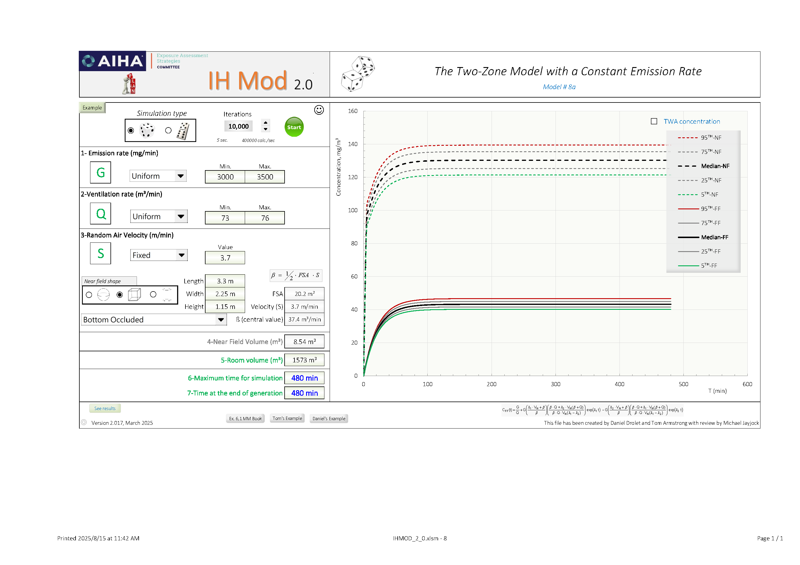

# **第七章：三氯乙烯脫脂槽附近的歷史暴露評估( 摘要)**

本章節旨在透過暴露評估模型，重建1990年代因TCE蒸氣脫脂槽作業引發的歷史暴露情境。由於缺乏實際監測數據，此回溯性評估對於釐清潛在的法律與健康問題至關重要。

## **評估流程與模型建立**

為重建暴露情境，我們首先收集了製程、化學品及作業空間的關鍵資訊。根據文獻與舊藍圖，估算出TCE逸散率(G)約為 **3,300 mg/min**，房間整體換氣率(Q)約為 **73.6 m³/min**。

考量到工人活動範圍包含高濃度的污染源周邊及濃度較低的房間其他區域，我們採用了**近場/遠場 (NF/FF) 二暴露區模式（Two-Zone Model）**進行評估。模型計算結果顯示：

-   **遠場 (FF) 穩態濃度**：約 **45 mg/m³**\
-   **近場 (NF) 穩態濃度**：約 **112 mg/m³**

## IH MOD 模擬 (二暴露區模式 Two Zone Model)

## **風險分析與結論**

結合工人的作業活動模式（每日約20%時間在近場，80%在遠場），計算出的**八小時日時量平均(TWA-8)暴露濃度約為 51 mg/m³**。此數值已非常接近當時的職業暴露限值 (TLV®-TWA, 54 mg/m³)，顯示工人處於臨界或超標的風險水平。

## **敏感度分析**

進一步的**敏感度分析**顯示，在一個合理的「最差情境」（逸散增加、通風變差）下，TWA-8暴露濃度可能飆升至 **89 mg/m³**，證實此作業具有高度的暴露超標風險。

## **評估後建議**

綜合評估結果，此作業的暴露風險被判定為**不可接受**。為保護勞工，應依循控制層級提出改善建議：

1.  **工程控制 (最優先)**：於脫脂槽加裝**局部排氣裝置(LEV)**，從源頭捕集污染物。\
2.  **行政管理**：限制工人在近場的作業時間，並強化安全作業訓練。\
3.  **個人防護**：要求佩戴合適的**呼吸防護具**（如有機蒸氣濾罐口罩）。\
4.  **環境監測**：建立定期監測計畫，以驗證控制措施的成效。
