# 1. EA整體概念？

## 暴露評估(EA)？

::: incremental
- 暴露：Source -\> Transport -\> **Contact** 的連續過程。
  - Exposure = Source + Generation + Transport + Ventilation + Worker Location
- 職業衛生決策架構 @jahn2015b
  - 預期、認知、[評估與控制]{.underline} + **確認（Confirm）**
- 暴露評估(Exposure Assessment)：指以定性、半定量或定量之 方法，評量或估算勞工暴露於化學品之暴露危害情形。
:::

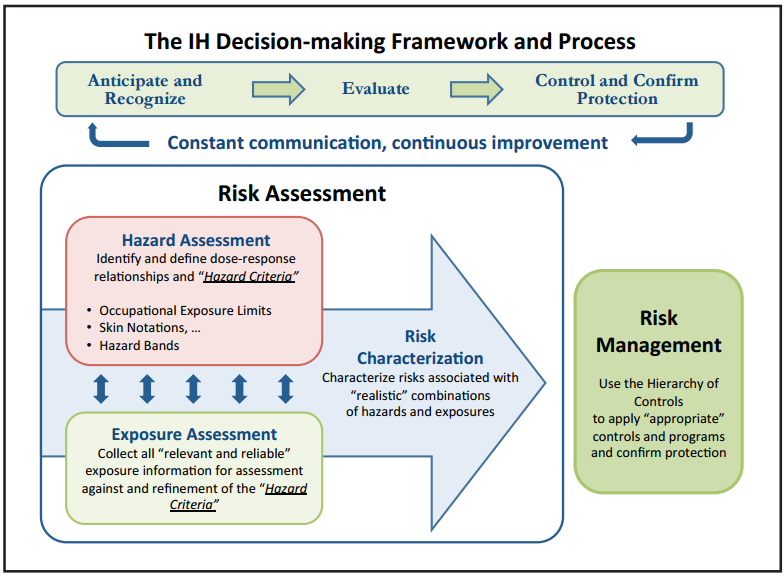{.lightbox width="100%"}

## Stressors - receptors model

- @keretetse2019

|                                                |
|------------------------------------------------|
| 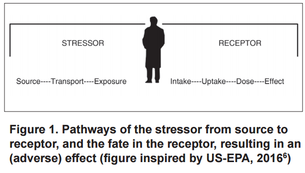{.lightbox} |

## 風險評估？

::: incremental
- Health Risk = (Exposure) (Toxicity)
  - 健康風險 = **f** (暴露量 ， 毒性)
    - 「毒性」（每單位暴露量**對目標器官所產生的健康效應**）
    - [暴露數據必須連結健康效應才有意義]{.underline}。
  - 暴露風險？ (數據)
    - 暴露評估 **+** 分級管理 ？
- 暴露評估（EA）**–\>** 暴露風險 ？
  - 準確性？效率？效能？
    - **取決於 OH 執行 EA 的品質**。
:::

## 風險評估？

- @keretetse2019

|                                                 |
|-------------------------------------------------|
| 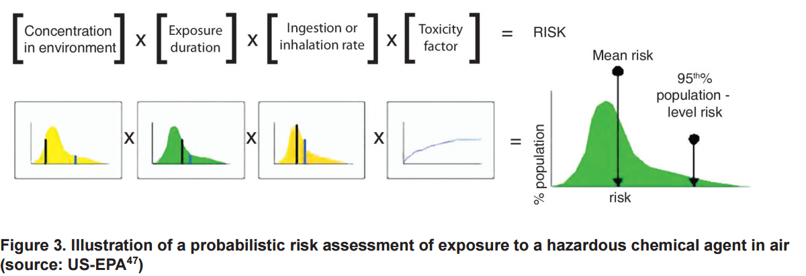{.lightbox} |

## EA 範圍與工具

::: incremental
- 範圍：不限於**化學物質**，還擴及皮膚、噪音、熱危害與人因工程等。
- 評估工具：更多數學模型及**貝氏決策分析（Bayesian Decision Analysis, BDA）**
  - 處理含有未檢出值的小型數據集特別有用。
- **從「合規性」到「全面性」**
  - 傳統「合規性策略（Compliance Strategy）」–\> 「全面性評估策略（Comprehensive Strategy）」
    - 許多化學品缺乏OEL，且現有標準未必能保護最敏感的勞工，也無法提供員工每日暴露變異的歷史數據。
    - **評估「所有勞工、在所有工作日、對所有危害物」的暴露情況**。
      - 建立全面的歷史暴露數據庫，不僅能在法規標準變嚴格時迅速因應，還能協助流行病學研究與員工的健康管理。
:::

## EA **步驟**

::: incremental
1.  **起始（Start）**：確立企業的評估目標與策略
2.  基本特徵描述（Basic Characterization）
3.  **暴露評估**：SEGs， OEL，決策統計量（Decision Statistic）$X_{95}, UTL$
4.  **進一步收集資訊**：針對「不確定」的暴露。
    - 優先安排空氣採樣或生物監測、數學建模，或收集毒理/流行病學數據等。
5.  危害控制：Hierarchy control，**分級管理** and **confirm**
6.  **重新評估**：定期，變更
7.  溝通與文件化（Communications and Documentation）

- 成功執行的關鍵：專業判斷+ 利害關係人的參與 + 資源的有效配置。 (**雇主支持？**)
:::

## EA 策略

::: incremental
- 策略類型
  - **全面性策略** (Comprehensive Strategy)
    - 掌握暴露強度與時間變異性
  - **合規性策略** (Compliance Strategy)
    - 非例行性作業 (Non-routine Operations)
- 專業判斷 (Professional Judgment)
  - 以科學(含統計)為基礎ˋ
- 產出：「書面」**暴露評估計畫** 與 **暴露評估報告**
:::

## 暴露實態（Exposure Profile）

- **暴露實態**：指描述SEGs的暴露強度及暴露強度隨時間變化之情形。
- **暴露強度**：具時間變異性（如每日變化）與推估值

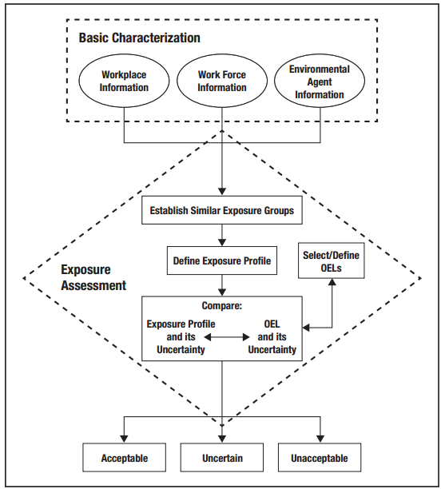{.lightbox width="100%"}

## 名詞說明

::: incremental
- **先期暴露風險評估**(Preliminary Exposure Risk Assessment)：指 在擬定作業環境監測採樣策略前，運用現有資訊、定性判 斷、簡單的半定量或是定量模式推估的方法，對 SEG 內勞工 暴露於特定化學因子的可能性及其潛在健康風險進行初步評 估的過程。
- **相似暴露族群**(Similar Exposure Group；SEG)：指一群勞工因 具相似的作業方式、工作製程、使用原物料及危害物接觸頻 率，致其暴露之有害物種類、強度及頻率均相似者。相似暴 露族群的判定是藉由勞工的工作內容、製程、控制設備、原 料物質等做為分類的依據，在執行作業環境監測後則需利用 統計確認之。
- **最大暴露危險族群**(Maximum Exposure Risk Group；MEG)指 各相似暴露族群中，具有最高暴露狀況實態者。
- **全盤式暴露評估**(Comprehensive Exposure Assessment)：指對 事業單位對全部相似暴露族群(SEG)之所有暴露，藉作業環 境監測實施暴露實態評估之採樣策略。
:::

## 名詞說明

::: incremental
- 採樣
  - **全面採樣**（Full Sampling）：指無論風險等級高低，對每個相 似暴露族群皆進行採樣者。
  - **完整採樣**：指對每個相似暴露族群的採樣樣本數量達其統計 意義足以描述其暴露時態者。
  - **監視採樣**：針對低暴露風險 SEG，以例行性方式追蹤作業環 境暴露狀況及風險趨勢的採樣活動。
  - **診斷性採樣**：針對作業環 境中潛在暴露因子及高風險區域進行的初步或特定性採樣， 以確認可能的職業健康風險。通常用於新作業、製程變更或 初次評估，特性為快速、針對性、揭示潛在問題。
:::

## 初始 EA (Initial EA)

::: incremental
- 是整個暴露評估分層、循環過程中的第一個階段
- 利用手邊現有的資訊來進行評估，但通常**缺乏足夠定量數據**。
:::

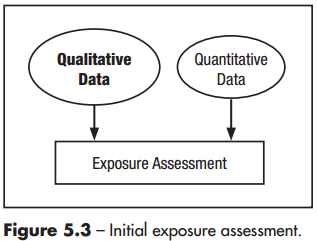{.lightbox width="100%"}

::: incremental
- 初始評估主要作為**篩選工具**
  - 迅速判斷出微不足道（可接受）及明顯超標的暴露（不可接受）。
    - major/minor cuts： 1/10 OEL + 不太可能導致不良健康後果 + 不違反法規要求
- **後續循環釐清「不確定」的風險**
:::

## 暴露分級（Exposure Ratings）

::: incremental
- 估算暴露量相對於「職業暴露容許標準（OEL）」的比例程度

  - 在缺乏大量監測數據的初始評估階段非常有用
  - **假設沒有使用個人防護裝備 (RPE)狀態下**
  - **缺乏 OEL 時**：可以根據基礎資料收集到的毒理學資訊，估算並設定一個「暫定/工作 OEL」，進行分級。

- 推估暴露實態與分級的工具主要有三種：@jahn2015b

  - 監測數據 (Monitoring Data)
  - 替代數據 (Surrogate Data)
  - 數學建模 (Modeling)
:::

## 暴露分級（Exposure Ratings）

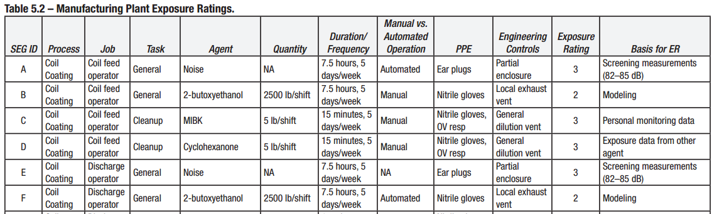{.lightbox width="100%"}

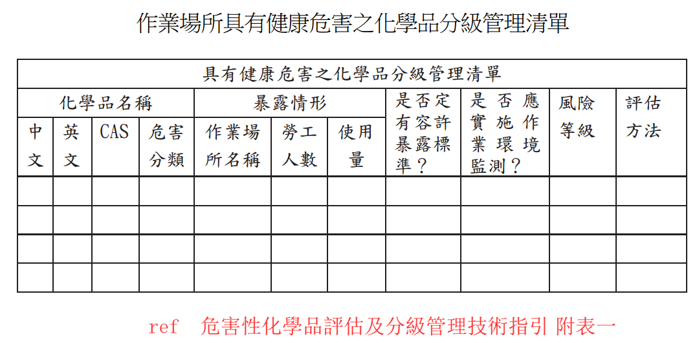{.lightbox}

## 監測數據 (Monitoring Data)

::: incremental
- 分「過去的個人監測數據」與「篩檢測量 **Screening**」
- **篩檢測量 (Screening measurements)** ：合適的直讀式測量
  - **工具**：使用如檢知管、光離子化偵測器（PID）、可呼吸性氣膠監測儀或噪音計等技術，提供快速的測量結果，協助校準工業衛生人員的專業判斷。

  - **應用**：可用於檢查「最壞情況（worst case）」或典型的暴露水準。釐清不同勞工或SEGs間的變異性。

  - **效能**：透過篩檢測量，可以減少甚至消除進行昂貴個人監測的需求。
:::

## 替代數據（Surrogate Data）

::: incremental
- 替代數據的應用必須非常謹慎，並高度仰賴專業判斷
- 替代數據也常用於估算混合物引起的暴露
- 主要分為以下兩大類應用方式：
  1.  來自其他危害因子的暴露數據 (Exposure data from another agent)
  2.  來自其他作業的暴露數據 (Exposure data from another operation)
- 替代數據是在**初始暴露評估階段**缺乏直接監測數據時，填補資訊空白並協助完成暴露分級的重要實用工具。
:::

## 數學建模（Modeling）

::: incremental
1.  **基於物理與化學特性的預測模型** (Predictive modeling based on physical and chemical properties)
    - 估計目前及推算**歷史暴露**
    - 階層式方法 (Tiered approach)
    - 刻意高估 (Purposeful overestimation)
2.  **基於製程資訊的預測模型** (Predictive modeling based on process information)
    - 包含許多製程參數

    - 建置製程模型來進行暴露評估
:::

## 暴露判定（Judging Exposures）

- 初始EA伴隨著極**大的不確定性**
- OEL 本身也可能存在不確定性

+----------------------------------------+----------------------------------------+
|                                        |                                        |
+========================================+========================================+
| 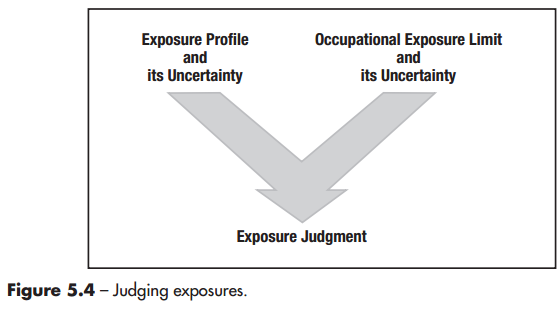{.lightbox} | 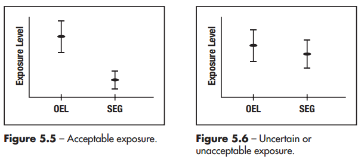{.lightbox} |
+----------------------------------------+----------------------------------------+

::: incremental
- 解決策略
  - **收集更多資訊**：縮小不確定性。
  - **直接視為不可接受**：成本效益評估，直接採控制措施。
:::

## 不確定的暴露 (Uncertain Exposures)

::: incremental
- **兩大主因**：
  - **暴露實態尚未充分掌握**：強度與變異
  - **缺乏健康效應數據**：無可靠的OEL
- 管理不確定性 (Managing Uncertainty)
  - 如果危害因子的毒性很低，且發生暴露的可能性也很低，那麼即使評估存在不確定性也無妨。

  - **不確定性的重要性極高**：如果暴露可能導致**極端、不可逆的傷害 (irreversible harm)**，那麼對於不確定性的容忍度就必須非常低，必須盡可能釐清暴露。
- **不確定性的兩大來源**：
  - **暴露的變異性**：日常變異。

  - **缺乏資訊**：當完全沒有數據或知識時，這種不確定性的程度會非常巨大，甚至會完全掩蓋掉日常的變異性。
- **評估不確定性的工具**： **主觀估計 (subjective estimate)**；**傳統統計分析(**有實際的測量數值，計算95%CI）；**機率分析工具 (如蒙地卡羅分析 Monte Carlo analysis，**複雜或關鍵的暴露評估**)**。
:::

## EA循環，持續改善

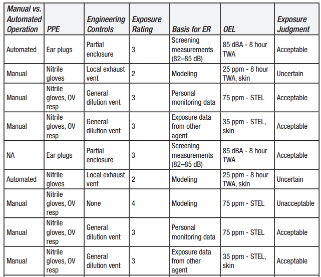{.lightbox width="100%"}

## **EA的具體產出**

::: incremental
- **掌握SEG**暴露實態推估
- **量化相對風險**：相對於OEL的暴露分級
- **決策判定**：暴露風險判定
- **後續風險管理 (分級管理)**
  - **排定後須行動優先順序並落實**
  - 釐清未知風險(不確定分級)，**進一步收集資訊**並解決。
- **暴露評估報告 (？)**
:::

# 2.先期暴露風險評估(EA)技術

## 數學建模（Modeling）

- **EA目的**：建立SEGs的暴露實態（含途徑、強度、持續時間與頻率），並將其與OEL（如 TWA-8、STEL）進行比較，以判定暴露是「可接受」、「不可接受」或「不確定」。
- 傳統上仰賴空氣採樣來建立暴露輪廓，但實際上，僅靠少數幾次測量是難以用參數統計學（如95%信賴區間）得出具備充分信心的結論。
- **初判再近一步確認** (降低不確定性)

## 數學建模主要用途

1.  **回推過去暴露**
    - 10年前的溶劑使用
    - 舊廠房粉塵暴露
    - 職業病鑑定
    - 當沒有實測數據時，可利用模型估算。
2.  **預測未來暴露 (Anticipation)**
    - 新化學品導入
    - 新製程設計
    - 新設備購置
3.  **控制措施評估**
    - 增加通風量
    - 局排設計
    - 降低生成率
    - 評估控制效果。

## 數學建模（Modeling）

### 為什麼需要數學建模？

::: incremental
- 資源有限與專業判斷的不足
  - 純粹的專業判斷常會低估實際暴露
- 跨越時間的多元應用 (過去、當下、與未來)
- 測量只知結果，建模能知可能原因 (物化特性)
- 數學模型並不是為了完全取代空氣採樣，而是要提升決策品質。
  - OH可以更自信地判定哪些低風險作業不需要採樣，進而**將昂貴的採樣資源與分析成本，集中投入在真正高風險的暴露情境上**。 (快篩？)
:::

## 如何建模？

- 物理化學特徵 + 暴露時間
- 容許不確定性（夠接近了嗎？合理的最壞情況 reasonable worst case）

### 收集建模資訊

::: incremental
- 化學物質資訊 (G...)

- 空間資訊 (V...)

- 空氣混合狀態 (WMB, NF/FF...)

- 勞工作業活動模式

- **資訊品質決定模型價值 (Garbage in, garbage out)**

  - 模型輸出的結果高度依賴輸入資訊的品質。
:::

## 定量 EA

### 分類

::: incremental
- 監測 (略)
- 推估模式
  1.  無通風推估模式(Zero Ventilation Model)
  2.  飽和蒸氣壓模式（Saturation Vapor Pressure Model）
  3.  暴露空間模式（Box Models）
  4.  完全混合模式（Well-mixed Room Model）
  5.  二暴露區模式（Two-Zone Model）
  6.  渦流擴散模式(Turbulent Eddy diffusion model)
  7.  統計推估模式(Statistical models)
  8.  其他具有相同效力或可有效推估勞工暴露之推估模式
:::

## 推估模式方法分層(Tiered Approach)

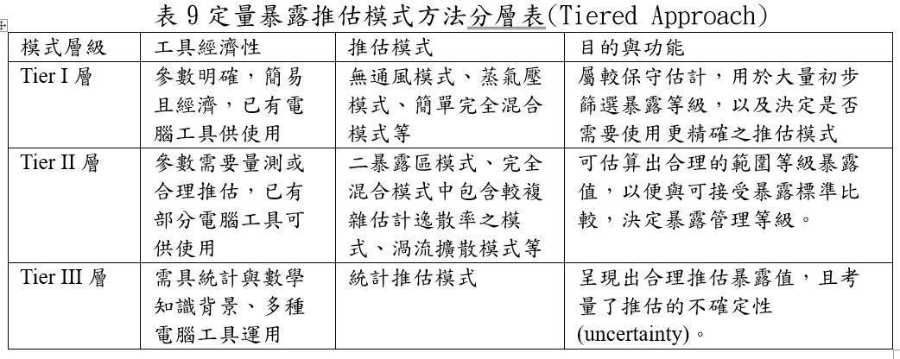{.lightbox width="100%"}

## 基本參數: 汙染物生成率

::: incremental
- **G**， Generation Rates ，mg/min
- 在空氣濃度建模中，準確估算化學物質釋放到空氣中的「生成率（或稱排放率）」是極為關鍵的步驟。
- **質量平衡法 (Mass Balance)**
  - 限制
    1.  無法反映短期波動：無法呈現製程中忽高忽低的間歇性釋放或極端峰值（peaks）。

    2.  不等於實際空氣濃度：「總排放量」不能直接等同於室內空氣的濃度。
- **排放係數法 (Emission Factors)**
  - 限制：除了前述外，還有製程差異「排放係數是製程的函數」。
:::

## Tier I 模式

### 1. 無通風推估模式(Zero Ventilation Model)

- 質量守恆原理，**假設最糟情境**，估算密閉空間中的最終平均濃度(最高值)。其**基本假設為**：
  - \(1\) 零通風(Zero Ventilation)
  - \(2\) 完全逸散與混合
  - \(3\) 無移除機制
- **公式** $C_{A}=\frac{M_{A}}{V}$
  - M~A~​：化學品A散布至空氣中的總質量(mg)；V：無通風室內之空氣體積(m³)。

## 實作情境- 1.無通風推估模式

#### 第一階段：情境描述 (Scenario)

- **事件發生**：你是一家中型製造廠的環安衛 (EHS) 人員。某天早上，一名員工打電話請病假，表示自己有嚴重的胃痙攣。
- **懷疑主因**：該員工懷疑這與他昨天打翻液體有關。昨天他在工作站打翻了一瓶化學品，隨後用工廠抹布將其擦乾。他當時覺得化學品味道很重，但沒有感到不適。
- **你的任務**：由於症狀是延遲發作的，你需要針對這起非典型暴露事件進行調查。你必須推估該員工在此次溢漏事件中的暴露濃度，以判斷其腹痛是否與暴露有關。

## 實作情境- 1.無通風推估模式 (續)

#### 第二階段：收集建模資訊

::: incremental
- **化學品資訊**：打翻的物質是**甲苯 (Toluene)**。液體密度為 **0.87 g/mL**。容許標準 (OELs)：PEL TWA-8 (8小時時量平均容許濃度) 為 **750 mg/m³**；更嚴格的 TLV TWA 為 **75 mg/m³**。
- **暴露時間與強度**：
  - 背景濃度：該工作區平時監測的甲苯暴露濃度為 **25 mg/m³**。
  - 溢漏時間點：事件發生在 8 小時班次中的第 5 個小時（這代表溢漏後的暴露時間最多只有 **3 小時**）。
  - 溢漏量：原本 500 mL 的瓶子大約半滿，因此約打翻了 **250 mL**。揮發時間：員工用抹布擦拭後將其放在 2 公尺外晾乾，約 **2 小時後**抹布全乾（代表甲苯已全數揮發）。
- **空間資訊**：
  - 房間尺寸為 10公尺 × 8公尺 × 3公尺高，算出總體積 (V) 為 **240 m³**。房間缺乏明確的通風率數據，也沒有機械排氣設備。
:::

## 實作情境- 1.無通風推估模式 (續)

#### 第三階段：模型推估 (Modeling Approach)

- (沒有通風數據)先採用最保守的「無通風模式 (Zero-Ventilation Model)」來進行初步篩查。這個模型假設房間是密封的，污染物釋放後會立刻均勻混合在空間中。
- **請估算空氣濃度 (C)，並做出結果專業判定。**

## 實作情境- 1.無通風推估模式 (續)

#### 參考建議

::: incremental
- C = **910 mg/m³，C** (TWA-8) = **360 mg/m³** 低於 PEL 標準 (750 mg/m³)，但高於 TLV 標準 (75 mg/m³)
- **風險等級：？**
  - 建議：改用「完全混合房間模型 (Well-Mixed Room Model)」重新計算更準確的數值？
- **健康關聯判定**：對照安全資料表，甲苯通常造成的健康影響是眼鼻刺激、頭暈等急性症狀，與該員工「延遲發作的胃痙攣」並不吻合。因此可以推論其病症很可能與此次暴露無關。(尋求職醫護協助)
- 請試試 [官方版工具](https://oemd.osha.gov.tw/exposure/content/tools/Tools2.aspx)
- 思考：是否適用於污水中有害物(硫化氫)逸散評估，或消防系統窒息性氣體(壓縮二氧化碳)於地下室突洩情境評估？
:::

## Tier I 模式

### **2.蒸氣壓模型（Vapor Pressure Models）**

- 包含飽和蒸氣壓模式、液體裝填釋放模式、開放液面蒸發模式及加壓容器洩漏釋放模式等。
  - 蒸氣壓越高：越容易揮發，暴露越高。
- 飽和蒸氣壓模式：**評估最糟暴露情境**

+--------------------------------------------------------+-------------------------------------------------------------------------------------------------+
|                                                        |                                                                                                 |
+========================================================+=================================================================================================+
| 簡化公式$\frac{VP_A}{P_{atm}} \cdot 10^6 = \text{ppm}$ | 單位換算 (原ppm)$\frac{VP_A}{P_{atm}} \cdot 10^6 \cdot \frac{\text{MW}}{24.45} = \text{mg/m}^3$ |
+--------------------------------------------------------+-------------------------------------------------------------------------------------------------+

- 留意應用限制與專業考量

## 實作情境-2.**蒸氣壓模型**

#### 第一階段：情境描述 @tenberge2009a

- **事件發生**：週末過後，一名勞工打開了實驗室的化學品儲存櫃。他發現櫃內有一瓶 500 mL 廣口瓶的揮發性液體忘記蓋上蓋子。瓶內還有液體，且儲存櫃內散發出極度強烈的溶劑氣味。該勞工立刻將瓶蓋鎖緊，但因為氣味太過強烈，他隨即離開房間（儲存櫃的門保持敞開），並通報環安室。
- **任務**：身為環安衛人員，您必須推算：**當這名勞工打開櫃門的那一瞬間，他面臨的暴露濃度有多高？**

## 實作情境- 2.**蒸氣壓模型 (續)**

#### 第二階段：收集建模資訊

- **化學品資訊 (正己烷, n-Hexane)**：分子量 (MW)：**86.2 g/mol**

  - 液體密度 (ρ)：**0.66 g/mL，**蒸氣壓 (Pv​)：**124 mmHg**
  - 爆炸極限：下限 (LEL) 為 **1.1% (11,000 ppm)**；上限 (UEL) 為 **7.5% (75,000 ppm)**
  - **容許標準 (OELs)**：PEL TWA-8 (美國法定 8 小時容許濃度)：**1,760 mg/m³；**TLV TWA (更嚴格的建議值)：**176 mg/m³；**IDLH (立即致危濃度)：**3,880 mg/m³**
  - **空間資訊 (儲存櫃內部空間)**：85 × 40× 40 cm= **0.136 m³**。

## 實作情境- 2.**蒸氣壓模型 (續)**

- **請估算空氣濃度 (C)，並做出結果專業判定。**

## **2.**實作情境- 2.**蒸氣壓模型 (續)**

#### 第三階段：模型推估演練 (飽和蒸氣壓模型)

- C = **163,000 ppm = 575,000 mg/m³**
- 驗證可達到飽和狀態？ **(yes)**
  - 計算所需揮發質量575,000 mg/m³×0.136 m³=78,200 mg
  - 換算為液體體積：78,200 mg×(1 g/1,000 mg)/0.66 g/mL=**118 mL**

## **2.**實作情境-**蒸氣壓模型 (續)**

#### 第四階段：結果判定 (Interpreting the Result)

- 遠超過了 IDLH (3,880 mg/m³) 與所有的 OELs 標準。
- TWA-8 依然高達 **2,400 mg/m³？建議應立即安排該名勞工進行健康檢查。**
- 火災/爆炸風險？
  - 163,000 ppm 相當於空氣中有 **16.3%** 的正己烷氣體。
  - 這個數值不僅超過了爆炸下限 (LEL 1.1%)，甚至超過了爆炸上限 (UEL 7.5%)。
  - 當櫃門被打開、高濃度氣體往外擴散並被房間空氣稀釋的過程中，濃度一定會無可避免地「穿越」爆炸範圍（降至 7.5% 與 1.1% 之間）。此時只要有任何火花，就會引發嚴重的爆炸危險。
- 請試試 [官方工具](https://oemd.osha.gov.tw/exposure/content/tools/Tools3.aspx)

## 2.蒸氣壓模型（混合物）

- 適用於混合溶劑(油漆、稀釋劑、清潔劑、消費產品等)

#### Raoult's Law

- PA = XA × Pv

  - XA = 莫耳分率

  - Pv = 純物質蒸氣壓

## Tier I 模式

### 3.暴露空間模式（Box Models）

- 基本參數：污染物釋放(G)及通風擴散(ventilation)
- **時間濃度解**
  - CA,room,0：初始濃度 (t=0)。 無沉降損失：K~sink~=0。(忽略沉降損失)。G~A~：恒定生成速率。 C~A,in~：進氣濃度。Q：通風率(m³/s)。

$C_{A,\mathrm{room},t}
=
\left(
C_{A,\mathrm{room},0}
-
C_{A,\mathrm{in}}
-
\frac{G_A}{Q}
\right)
e^{-\frac{Q(t-t_0)}{V}}
+
C_{A,\mathrm{in}}
+
\frac{G_A}{Q}$

- **穩態濃度**

$C_{A,\mathrm{room},\mathrm{SS}}=C_{A,\mathrm{in}}+\frac{G_A}{Q}$

- **平均暴露濃度-時間加權**

$C_{\mathrm{avg}}=C_{A,\mathrm{in}}+\frac{G_A}{Q}+\frac{V}{Q(t-t_0)}\left[\left(C_{A,\mathrm{room},0}-C_{A,\mathrm{in}}-\frac{G_A}{Q}\right)\left(e^{-\frac{Q(t-t_0)}{V}}-1\right)\right]$

## 實作情境-3.暴露空間模式

- **情境描述**：在一間尺寸為5m×6m×2m(體積V=60 m³)的實驗室內，一名勞工將進行甲苯塗層作業。已知該作業的甲苯逸散率G經評估為50 mg/s。實驗室的通風換氣率Q為0.1 m³/s。作業開始前，室內與進氣的甲苯背景濃度均為10 mg/m³。假設：完全混合、無沉積效應(Sinks)。

  1.  **請評估**作業開始20分鐘後，實驗室內的平均甲苯濃度，以判斷是否可能超過短時間暴露限值。
  2.  **請估算**房間內甲苯的穩態濃度，並評估其暴露風險。

- 請試試 [官方工具](https://oemd.osha.gov.tw/exposure/content/tools/Tools4.aspx)

## Tier II 模式

### 4.完全混合模式(Well-mixed Room Model, WMR)

- 當**G, Q, and/or CA.in發生變化**的動態情境下的建模
  - 在許多真實情境下，污染物的生成率 (G)、通風量 (Q)，或是進氣中的污染物濃度 (CA,in​) 都會隨著時間而改變。
- 模式包括濃度隨時間的動態變化解、穩態濃度解，以及考量背壓效應(back pressure effect)、間歇性排放等進階情境。
- **濃度變化估算公式**

+-----------------------------------------------------------------------+
|                                                                       |
+=======================================================================+
| 微分質量平衡的數值解                                                  |
|                                                                       |
| $\frac{dC_{A,\text{room}}}{dt} = C_{A,\text{room}} \cdot A(t) + B(t)$ |
+-----------------------------------------------------------------------+
| $A(t) = \left[ \frac{-(Q + K_{\text{sink}})}{V} \right]$              |
+-----------------------------------------------------------------------+
| $B(t) = \frac{Q_A}{V} \cdot C_{A,\text{in}} + \frac{G_A}{V}$          |
+-----------------------------------------------------------------------+

## 實作情境- 4.完全混合模式(動態變化)

#### 有機溶劑塗佈-濃度動態變化

- 某工廠零件塗佈機在室溫波動環境下運行，需評估甲苯濃度的動態變化及勞工暴露風險。**已知條件**：**房間**體積V=25 m3，通風率Q=1.0 m3/min(換氣次數2.4ACH)。**甲苯排放率**隨溫度變化(增減)，可依據Clausius-Clapeyron方程估算。

$G_A(T) = 450 \cdot \exp \left[ 4660 \left( \frac{1}{294.3} - \frac{1}{T + 273.15} \right) \right] \text{ mg/min}$

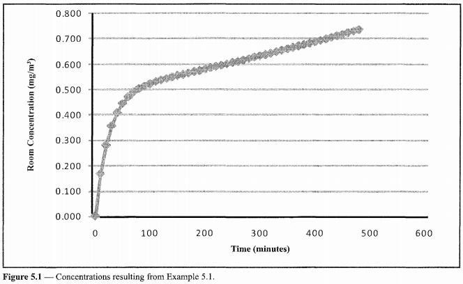{.lightbox width="50%"}

- 在作業持續480分鐘(8小時)後，濃度逐漸趨於穩定，最終達到約195 ppm。

- **請提出你的風險評估與後續行動**

## 實作情境- 4.完全混合模式(動態變化) (續)

#### 第一階段：**情境描述** (排放率隨時間指數遞減)@acase-b2023

- **作業內容**：某中型製造廠的員工在生產線旁清潔面板。每 3 分鐘會有一塊面板經過，員工會用噴瓶將含 4% 醋酸 (Acetic Acid) 的清潔液噴灑在面板上，接著用紙巾擦拭。
- **作息時間**：員工早上 8:00 上班，10:00 休息 15 分鐘，12:00 午餐休息 30 分鐘，14:30 再休息 15 分鐘，16:00 下班。休息期間員工離開工作站，暴露為零。
- **評估**：醋酸的蒸氣壓較低，揮發速度慢。如果假設它「瞬間完全揮發」，算出來的濃度會被過度高估（TWA-8 約為 7 mg/m³）。因此，建立一個「隨時間變動、緩慢揮發並疊加」的排放指數遞減模型，來求得更精確的暴露濃度。

## 實作情境- 4.完全混合模式(動態變化) (續)

- 濃度解(排放指數遞減)

$C_t = \sum_{i=1}^{n} \frac{\alpha \cdot M}{\alpha \cdot V - Q} \cdot \left( e^{\frac{-Q \cdot t_i}{V}} - e^{-\alpha \cdot (t - t_i)} \right)$

#### 第二階段：收集建模參數

- α **(排放率常數)**：根據文獻，類似擦拭作業的醋酸排放率常數約為 **0.006 min⁻¹**。

- **M (每次投入質量)**：經換算清潔液的濃度與噴灑體積，每次清潔一塊面板會投入 **481 mg** 的醋酸。

- **V (箱體體積)**：根據工作站與員工活動範圍，設定一個虛擬的完全混合箱體，體積為 **18.75 m³**。

- **Q (通風量)**：根據現場氣流速度與箱體截面積，算出通過箱體的通風量為 **20.0 m³/min**。

## 實作情境- 4.完全混合模式(動態變化) (續)

#### 第三階段：數學模型估算

- **單次噴灑的濃度變化**：指數遞減的揮發率與通風稀釋。每一次噴灑（投入 M = 481 mg）後，醋酸會慢慢揮發，同時又被通風 (Q) 帶走。
- **估算連續作業的濃度疊加**：每 3 分鐘就會噴灑一次新的面板，前一次噴灑的醋酸還沒揮發完，新的醋酸又加進來了。因此，特定時間點的總濃度，是「所有過去噴灑」在該時間點殘留濃度的**總和**。

## 實作情境- 4.完全混合模式(動態變化) (續)

#### 第四階段：結果判定 (Interpreting the Result)

- 透過試算表完成一整天 8 小時 (480 分鐘) 的模擬後，您可以進行以下決策：

1.  **檢視最大極值**： 隨著時間推移，作業區的氣體濃度會像爬樓梯一樣慢慢累積，並在班次結束前達到最高峰的 **6.6 mg/m³**。

2.  **計算 TWA-8 (8小時時量平均濃度)**： 將各個工作時段與休息時段的濃度平均起來，算出該員工真實的 TWA-8 為 **4.7 mg/m³**。

3.  **做出風險管理決策**：

    - 法定標準 (PEL/TLV) 為 25 mg/m³。這代表員工的暴露量符合法規標準。
    - 然而，該公司內部的安全目標是「維持在 OEL 的 10% 以下 (即 2.5 mg/m³)」。
    - **最終判定**：既然算出的 4.7 mg/m³ 超過了內部 10% 的標準（約佔 16%），環安衛團隊應判定此風險「無法僅憑專業判斷結案」，並決定安排後續的實體空氣採樣監測計畫來驗證此結果。

## Tier II 模式

### 5. 二暴露區模式（Two-Zone Model）

- 又稱近場/遠場模式 **(NF/FF)**
  - **近場**：緊鄰污染源的區域，通常涵蓋勞工的呼吸帶。
    - 以污染源為中心、半徑約為1-2公尺的半球體。
  - 二區域間空氣速率(β)的進行動態質量交換。
  - 模式**基本假設**是：每個區域內部完全混合。
- **特別適用**：點源汙染逸散、 通風不良。
- 模式數學公式
  - **時間濃度解**

+--------------------------------------------------------------------------------------------------------------------------------------------------------------------------------------------------------------------------------------------------------------------------------------------------------------------------------------------------------------------+
|                                                                                                                                                                                                                                                                                                                                                                    |
+====================================================================================================================================================================================================================================================================================================================================================================+
| $C_N(t) = \frac{G}{\left(\frac{\beta}{\beta + Q}\right)Q} + G \left[ \frac{\beta Q + \lambda_2 V_N (\beta + Q)}{\beta Q V_N (\lambda_1 - \lambda_2)} \right] e^{\lambda_1 t} - G \left[ \frac{\beta Q + \lambda_1 V_N (\beta + Q)}{\beta Q V_N (\lambda_1 - \lambda_2)} \right] e^{\lambda_2 t}$                                                                   |
+--------------------------------------------------------------------------------------------------------------------------------------------------------------------------------------------------------------------------------------------------------------------------------------------------------------------------------------------------------------------+
| $C_F(t) = \frac{G}{Q} + G \left[ \frac{\lambda_1 V_N + \beta}{\beta} \right] \left[ \frac{\beta Q + \lambda_2 V_N (\beta + Q)}{\beta Q V_N (\lambda_1 - \lambda_2)} \right] e^{\lambda_1 t} - G \left[ \frac{\lambda_2 V_N + \beta}{\beta} \right] \left[ \frac{\beta Q + \lambda_1 V_N (\beta + Q)}{\beta Q V_N (\lambda_1 - \lambda_2)} \right] e^{\lambda_2 t}$ |
+--------------------------------------------------------------------------------------------------------------------------------------------------------------------------------------------------------------------------------------------------------------------------------------------------------------------------------------------------------------------+

- 穩態濃度

+--------------------------------------------+--------------------------+
|                                            |                          |
+============================================+==========================+
| $C_{N,SS} = \frac{G}{Q} + \frac{G}{\beta}$ | $C_{F,SS} = \frac{G}{Q}$ |
+--------------------------------------------+--------------------------+

## 實作情境1- 5.二暴露區模式

- **情境描述**：一名勞工坐在工作台旁，手動塗抹含甲苯的黏合劑，甲苯以恆定速率 G=1,000 mg/min蒸發。
- **近場(NF)**：假設為半球形(半徑 r = 0.76 m)，體積V~N~ = 0.93 m^3^，自由表面積 FSA=3.6 m^2^。空氣流速：隨機空氣速度S=3.7 m/min(中位數)。
- 房間參數：總體積200 m^3^，通風速率 Q=20 m^3^/min(每小時6次換氣)，初始條件：甲苯濃度為 0。
- **請進行該名勞工暴露評估。**

## 實作情境- 5.二暴露區模式 (續)

- 暴露濃度推估？

- 暴露風險與建議行動？

- 試試 [官方版工具](https://oemd.osha.gov.tw/exposure/content/tools/Tools5.aspx)

## 實作情境2- 5.二暴露區模式 (續)

#### 回溯性評估個案

#### 第一階段：情境描述

- **事件背景**：一家製造廠使用了「開放式三氯乙烯（TCE）蒸氣脫脂槽」來清洗金屬零件。當時在該廠工作的勞工後來出現了不良健康反應，並引發了**法律訴訟**。
- **現場狀況**：勞工每天會在脫脂槽附近（距離幾公尺的長凳上）進行零件準備與組裝，也會直接操作脫脂槽。廠方缺乏系統性的暴露評估紀錄，僅有三筆濃度數據（22、25、40 mg/m³），但缺乏採樣位置、時間與人員的資訊，無法直接採用。
- **任務**：身為專家，您必須**利用數學建模來回溯推估**當時脫脂槽周圍的 TCE 歷史濃度，以釐清這些暴露是否可能導致勞工的健康危害。

## 實作情境2- 5.二暴露區模式 (續)

#### 第二階段：收集建模資訊

- **化學品**：TCE 是一種無色、具甜味且高度揮發的液體。其法定的 PEL TWA-8 為 537 mg/m³，但更嚴格的建議標準 TLV TWA 僅為 **54 mg/m³**。
- **計算排放率 (G)**：
  - 根據文獻，開放式 TCE 脫脂槽的排放係數為 2.9 g/min/m²。脫脂槽的開放表面積為 1.14 m²。推算排放率約等於 **3,300 mg/min**。
- **計算房間通風量 (Q)**：
  - 房間有 4 個送風口，每個設計風量為 650 ft³/min，總通風量為 2,600 ft³/min。換算為公制單位：Q=**73.6 m**3**/min**。

+----------------------------------------+----------------------------------------+----------------------------------------+
|                                        |                                        |                                        |
+========================================+========================================+========================================+
| 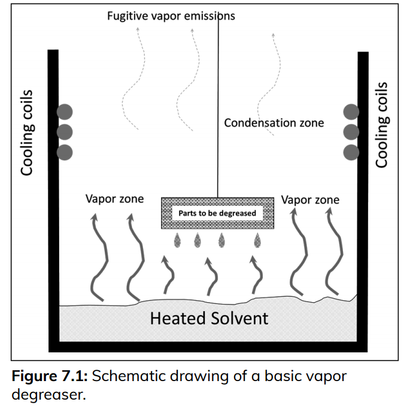{.lightbox} | 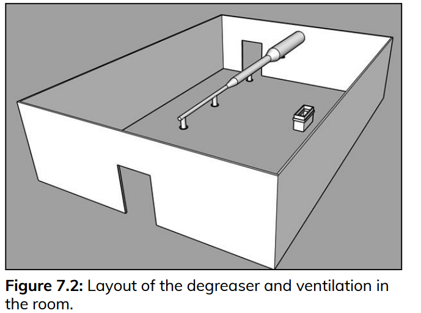{.lightbox} | 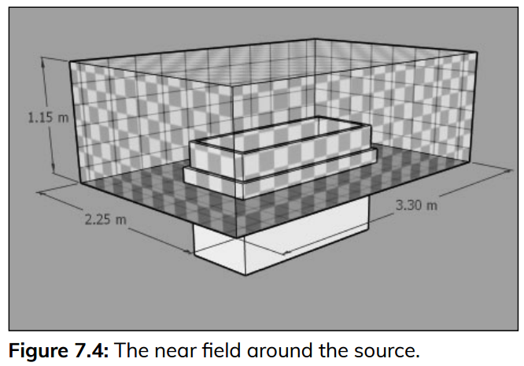{.lightbox} |
+----------------------------------------+----------------------------------------+----------------------------------------+

## 實作情境2- 5.二暴露區模式 (續)

#### 第三階段：雙區模型推估

- **遠區穩態濃度 (**CF,SS​**)** ：遠區的濃度是由整體的通風量來稀釋。公式：CF,SS​=G/Q = **45 mg/m**3
- **區域間空氣交換率 (**β**)** ：公式：β=1/2​×FSA×s = 0.5×26.5 m2×3.7 m/min(文獻)=**49.0 m**3**/min**
- **計算近區穩態濃度 (**CN,SS​**)** 近區濃度 = 遠區的背景濃度 + 污染源在近區產生的局部濃度。公式：CN,SS​=(G/Q)+(G/β) = **112 mg/m**3

## 實作情境2- 5.二暴露區模式 (續)

#### 第四階段：結果判定與風險評估

- **計算 8 小時時量平均濃度 (TWA-8)**

  - **勞工作息**：8 小時的班次 (480 分鐘) 中，有 60 分鐘在午餐與休息區 (濃度為 0)；在作業房間內的 420 分鐘裡，約 20% 的時間 (84 分鐘) 待在近區，80% 的時間 (336 分鐘) 待在遠區。

- **TWA 計算**： $\frac{(112\text{ mg/m}^3 \times 84\text{ min}) + (45\text{ mg/m}^3 \times 336\text{ min}) + (0 \times 60\text{ min})}{480\text{ min}}$

  ​=**51 mg/m**3

- **風險評估與敏感度分析**

  - **比對標準**：推算 TWA 為 51 mg/m³，這個數值剛好落在 TLV 標準 (54 mg/m³) 的邊緣。這代表當時勞工的暴露風險確實不容忽視。

- **試算表與情境變更**：在法庭上，可能會質疑參數設定。您可以利用模型，隨時調整變數來因應質疑。例如，若對方主張「當時設備老舊排氣不佳，且冷卻盤管故障導致排放量多 30%」，您只要將參數更改，模型就能立即算出新的 TWA 為 **89 mg/m³**。此結果明顯超標，更能支持勞工暴露過量的主張。

## Tier II 模式

### 6.渦流擴散模式(Turbulent Eddy diffusion model)

(略) 自行參酌技術手冊介紹，使用 官方版工具

## Tier III 模式

### 7.統計推估模式(Statistical Models)

- 從「已發生的暴露數據」著手，運用統計學方法來「解釋」濃度變化的原因，並據此建立預測模型。
- 模式種類：參見技術手冊 表 7 統計模式整理表
- 實作情境：(略) 請參考技術手冊

## 模式選用 (搭配工具)

- 面對特定的暴露情境，該**如何選擇最合適的評估模式**？
- 「**多層次評估**」(Tiered Approach)概念(**AIHA**)
  - Tier I 模式(第一層初步篩選模式)
  - Tier II 模式(第二層精緻化評估模式)
  - Tier III 模式(第三層機率性評估模式)
- 模式演練 (WMB + 蒙地卡羅模型)

## 實作演練比較 (WMB + 蒙地卡羅模型)

#### 第一階段：情境描述

- **事件**：一所大學化學系老師反映，在進行有機化學實驗（使用二氯甲烷進行萃取）時，溶劑氣味特別明顯。因為學校預算吃緊，在花錢進行實體空氣採樣之前，您希望先透過數學建模來進行初步的暴露評估。
- **任務**：推算實驗室內的二氯甲烷（Methylene Chloride, MeCl2）濃度，並評估學生的暴露風險是否在可接受範圍內。

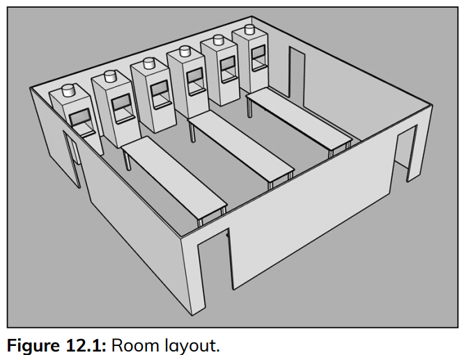{.lightbox width="50%"}

## 實作演練比較 (續)

#### 第二階段：收集建模資訊

- 透過SDS、閱讀實驗手冊並與講師訪談，收集以下關鍵數據：
  - **化學品與法規標準**：二氯甲烷的液體密度為 1.33 g/mL，法定的 PEL TWA-8 為 **87 mg/m³**。
- **空間與通風資訊**：實驗室體積為 294 m³。透過測量排氣櫃表面風速，估算出房間平均總通風量 (Q) 波動範圍落在 **67 至 133 m³/min** 之間。
- **作業與排放資訊**：
  - **時間**：實驗課程長度為 180 分鐘。每班最多 24 名學生，但也可能少至 12 名學生。每位學生配發 60 mL 溶劑。實際上學生會回收溶劑，真正揮發的量約在 10 至 40 mL 之間。因此，推估每位學生的實際排放率落在 **74 至 296 mg/min** 之間。

## 實作演練比較 (續)

#### 第三階段：模型推估

#### 模式一：(WMB) (最壞與最佳情況)

1.  **最壞情況**：假設 24 名學生將 60 mL 溶劑全數揮發 (總排放率 G = 10,640 mg/min)，且通風量為 67 m³/min。
    - 計算：Css​=G/Q=10,640/97=**159 mg/m³**。此數值高於 PEL (87 mg/m³)。
2.  **最佳情況** ：只有 12 名學生，且操作謹慎（每人排放 74 mg/min），且通風量達到最高的 133 m³/min。
    - 計算：Css​=(12×74)/133=**6.7 mg/m³**。

- **風險評估決策？**：算出的濃度範圍從 6.7 到 159 mg/m³，範圍極大。實務上，「所有最壞條件同時發生」或「所有最佳條件同時發生」的機率微乎其微。

## 課程結論

::: incremental
1.  **數學建模的目的**並非要完全取代實體的空氣採樣，而是作為暴露評估的第一道、也是最具成本效益的篩選工具。
2.  模型的選擇具備**「階層性」**：從極端保守到貼近真實。
3.  評估成敗的關鍵在於**參數數據品質**。
4.  **多利用工具軟體**
5.  決策的核心：推估值與 OEL 的比較與專業建議
:::

## 

## 實作演練

#### 模式二：蒙地卡羅模型 機率性推估

- 實作：使用 AIHA [**IHMOD Tool**](https://www.aiha.org/public-resources/healthierworkplaces/workplace-hazards/apps-and-tools-resource-center/aiha-risk-assessment-tools/ihmod-tool)
- IH Mod 2.0 是 AIHA Exposure Assessment Strategies Committee 開發的暴露評估數學模型工具，用於：
  - 預測職業暴露（Occupational Exposure）

  - 預測消費者暴露（Consumer Exposure）

  - 補足無法量測時的暴露評估

  - 評估未來新製程或新化學品的暴露情境

  - 找出影響暴露的重要因子

實作演練([網頁](EA實作演練Q.html))

## IH Mod 2.0 重要輸入參數

+----------+----------------+--------------+--------------------------------------------+--------------------------------------------+
| 參數     | 全名           | 單位         | 功能                                       | 常見取得方式                               |
+==========+================+==============+============================================+============================================+
| **G**    | 污染物生成率   | mg/min       | 決定污染物進入空氣的速率，是最重要輸入參數 | 質量平衡、蒸發模型(Hummel)、文獻、實測資料 |
+----------+----------------+--------------+--------------------------------------------+--------------------------------------------+
| **V**    | 空間體積       | m³           | 描述污染物被稀釋的空間大小                 | 房間尺寸長×寬×高計算                       |
+----------+----------------+--------------+--------------------------------------------+--------------------------------------------+
| **Q**    | 通風量         | m³/min       | 移除污染物的重要因子                       | ACH換算、通風設計資料、現場量測            |
+----------+----------------+--------------+--------------------------------------------+--------------------------------------------+
| **Csat** | 飽和蒸氣濃度   | ppm 或 mg/m³ | 理論最高氣相濃度，用於結果合理性檢查       | 蒸氣壓(VP)計算                             |
+----------+----------------+--------------+--------------------------------------------+--------------------------------------------+
| **M₀**   | 初始污染物質量 | mg           | 用於 Spill 或瞬間釋放模型                  | 洩漏量、使用量估算                         |
+----------+----------------+--------------+--------------------------------------------+--------------------------------------------+
| **α**    | 一階蒸發常數   | min⁻¹        | 控制污染物衰減速度                         | 文獻、實驗量測、IH Mod Support File        |
+----------+----------------+--------------+--------------------------------------------+--------------------------------------------+
| **β**    | 區域交換率     | m³/min       | Near Field 與 Far Field 間的空氣交換       | 由球體半徑與空氣流速 S 自動計算            |
+----------+----------------+--------------+--------------------------------------------+--------------------------------------------+
| **Dt**   | 亂流擴散係數   | m²/min       | 描述污染物於空間中擴散能力                 | 文獻值、實驗反算、預設值0.5 m²/min         |
+----------+----------------+--------------+--------------------------------------------+--------------------------------------------+
| **U**    | 定向氣流速度   | m/min        | 影響污染物隨氣流移動方向與速度             | 現場風速量測或估算                         |
+----------+----------------+--------------+--------------------------------------------+--------------------------------------------+

## 參考資料
